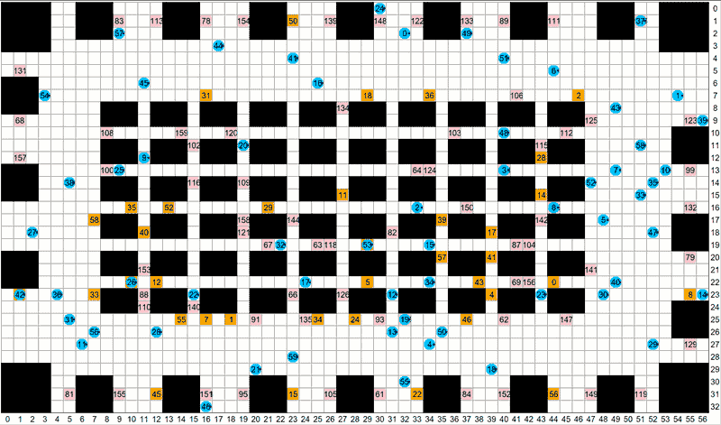

## Problem Overview 

In this competition a team of robots is tasked with running an infinite number of errands in a grid environment. These types of problems are the core challenge in a variety of real-world application settings, such as warehouse logistics, multi-robot manufacturing and multi-agent computer games. 

On this page we give an overview of the problem model, the robot model, and the centralised controller that coordinates the execution of your computed plans.The figure above shows a typical example of a problem instance in a warehouse domain we call **fulfilment**.

## Robots and Their Environment 
Each grid map is deterministic, fully observable and known ahead of time. All robots move in parallel. Time is divided up into discrete time steps. 

At each timestep, a robot can execute one of the following actions: 
> - move forward into an adjacent grid cell
> - rotate 90 degree clockwise 
> - rotate 90 degrees counter-clockwise
> - wait at its current location.

| `Moving Forward` |  `Rotate` |
|:---:|:---:|
|  |   |

An action is considered valid (or feasible) if the robot can execute that action without colliding with static obstacles in the environment or with other moving robots. Each valid action has a duration of exactly one timestep. 

We consider two types of collisions that can occur between pairs of agents.:
> - Vertex collision: two agents occupy the same location at the same time.
> - Edge collision: two agents traverse the same edge from opposite directions at them same time.

| `Vertex` |  `Edge` |
|:---:|:---:|
|  |   |

## Tasks  and Errands  

An errand is a request that requires a particular robot to visit a specific **target location** on the grid. The errand is completed when the assigned robot arrives at the corresponding location.

A task may consist of multiple errands, with the number of errands per task \( N \) falling within the range \([minEPT, maxEPT]\), where \( minEPT \) denotes the minimum number of errands per task and \( maxEPT \) denotes the maximum number of errands per task. When a task is revealed, the number of errands, the sequence order, and the errands themselves are all revealed. A task is finished when the assigned robot has completed all the errands in the task following the sequence order.

**The objective for tasks** is to complete as many tasks as possible in the given time. Just like errands, the order of the errands within a task matters, and they must be completed in sequence. Managing both task assignment strategy and path planning method is crucial for optimal performance.

## The Central Controller
The correct operation of robots in the environment is the responsibility of a central controller. The controller tracks the current position of all robots and it is responsible for issuing commands to the robots, which tell them what action to perform next. 

To decide which command to issue to which robot the controller relies on a component called **a planner, that you must implement**.  The controller calls the planner at each timestep. The job of the planner is to return one valid command for each robot.  If the planner does not provide a valid set of commands (one for each robot), or if it does not finish computing in time, then the controller asks all robots to **wait in place**, until the next timestep or until the planner finishes deliberating. 

The central controller tracks the amount of time elapsed since the start of the problem (another name for this is **wallclock time**). Time elapses while the planner is deliberating. After a fixed amount of time, called the **planning horizon**, the central controller stops and the problem is considered finished. 
