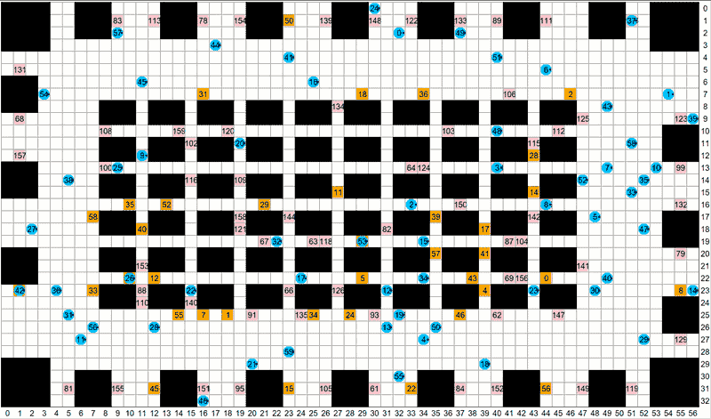

# Problem Setup

In this competition a team of robots is tasked with running errands in a grid environment. These types of problems are the core challenge in a variety of real-world application settings, such as warehouse logistics, multi-robot manufacturing and multi-agent computer games. The figure shows a typical example in a warehouse domain we call **fulfilment**.

## Robots and their environment
Each grid map is deterministic, fully observable and known ahead of time. All robots move in parallel. Time is divided up into discrete time steps. 

At each timestep, a robot can execute one of the following actions: 
- move forward into an adjacent grid cell
- rotate 90 degree clockwise 
- rotate 90 degrees counter-clockwise
- wait at its current location.

Moving Forward:

Rotate:

An action is considered valid (or feasible) if the robot can execute that action without colliding with static obstacles in the environment or with other moving robots. Each valid action has a duration of exactly one timestep. 

## Errands
An errand (or task assignment) is a request that says a particular robot needs to visit a specific **target location** on the grid. The errand is finished when the assigned robot arrives at the corresponding location.

Robots are assigned errands in a particular sequence. The next errand in the sequence is revealed when the current errand is completed. The total number of errands is infinite. **The objective** is to **run as many errands as possible** in a fixed amount of time.  

## The central controller
The correct operation of robots in the environment is the responsibility of a central controller. The controller tracks the current position of all robots and it is responsible for issuing commands to the robots, which tell them what action to perform next. 

To decide which command to issue to which robot the controller relies on a component called **a planner, that you must implement**.  The controller calls the planner at each timestep. The job of the planner is to return one valid command for each robot.  If the planner does not provide a valid set of commands (one for each robot), or if it does not finish computing in time, then the controller asks all robots to **wait in place**, until the next timestep or until the planner finishes deliberating. 

The central controller tracks the amount of time elapsed since the start of the problem (another name for this is **wallclock time**). Time elapses while the planner is deliberating. After a fixed amount of time, called the **planning horizon**, the central controller stops and the problem is considered finished. 
