## Problem Overview 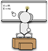

A team of robots works together in a simplified grid environment. Their job is
to run infinite errands, which they accomplish by visiting different locations
on the grid. Sometimes errands must be completed in a specific order. A
sequence of such errands is called a task. The [objective](./evaluation) is to
complete as many tasks as possible, as quickly as possible, until time runs
out. 

These types of problems are the core challenge in many real-world applications,
including warehouse logistics, multi-robot manufacturing, multi-agent computer
games and many more besides. The image below shows an example from a warehouse
domain, which we call **fulfilment**. 

 

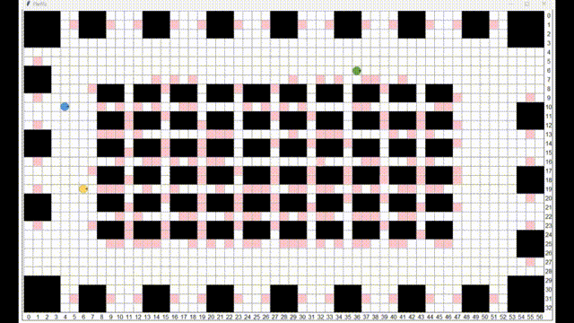

 

On this page you can find further descriptions of the the problem setting, the
robot model, and the centralised controller that is responsible for plan
validation and execution. More granular technical details are available in
our competition [Start-Kit](https://github.com/MAPF-competition/Start-Kit)

## Robots and Their Environment 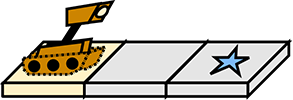
The **environment** is a grid map comprised of traversable and non-traversable cells
(obstacles). It is deterministic, fully observable, and known ahead of time. Each **robot** occupies a single grid cell and has a designated orientation called `Forward`. 
Time is divided into unit-sized time ticks. 

### Actions

Each robot receives a sequence of intended actions that tells it how to move. This is called a **plan**. Each action has a minimum duration of d time ticks.  The available actions are as follows:
- FW: Move Forward into an adjacent grid cell (d >= 10)
- CR: Rotate 90 degree clockwise (d >= 10)
- CCR: Rotate 90 degrees counter-clockwise (k >= 10)
- W: Wait at the current location (d >= 1)

| `Forward` |  `Rotate` |
|:---:|:---:|
| 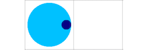 | 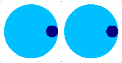 |

### Commands

The robots move together, in parallel. When a robot is ready to move, it places its planned actions into a queue for subsequent execution. We say that these actions are **staged**. The execution of an action is controlled by issuing a robot with a series of `STOP` and `GO` commands, each requiring the passing of one time tick.  

- GO: allow the robot to progress the action by one duration.
- STOP: progress does not increase.

To track the execution progress of an action, each robot maintains two integers:
- Counter: how many successful `GO` commands in the current action.
- Max Counter (d): how many successful `GO` commands are required to complete one action.

Once a robot begins an action, the robot is committed to finishing that action. A robot cannot start a different action halfway through. However, a robot is allowed to pause its execution by issuing a `STOP` command.

On each executed tick, the robot increments one counter if it receives a successful “GO” command. When the counter reaches Max Counter, the counter resets, and the action completes. Otherwise, the robot is considered mid-action (“on the edge” or “in rotation”).  

<figure>
  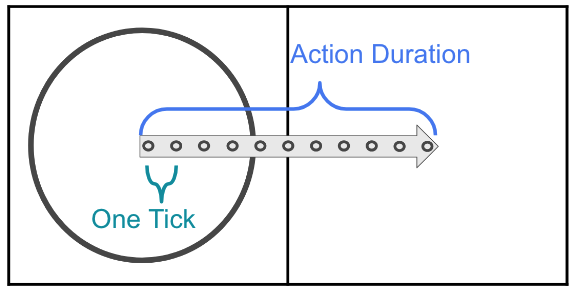
  <figcaption>
    Each action has a duration of k “ticks” (the minimum resolution of the clock).
    We measure the progress of the agent through the action by counting the number of elapsed ticks.
  </figcaption>
</figure>

### Motions and Collisions

To support realistic execution, the simulator maintains a continuous “real position” for robots during action execution.
During a Forward action, the robot moves gradually from the centre of its current cell toward the centre of the next cell over ticks. Intuitively, if the max counter is K, then at each tick, it advances about 1/K of a cell.
During Rotate actions, the robot does not translate (it stays within its current cell while turning).
When an action completes, the robot snaps back to a discrete state at a cell center (and the location/orientation is updated accordingly).
This competition does not use discrete MAPF “vertex collisions” or “edge collisions”.

Instead, collisions are defined using geometric overlap:
Each robot is wrapped by a rectangular safety bubble (an axis-aligned square). The size of this square is a competition parameter. Obstacles are treated as solid unit squares.
A collision occurs if any of the following happens:
Two robots’ safety squares overlap
A robot’s safety square overlaps an obstacle square
The executor enforces safety at every tick. If executing a robot’s next action step would cause a collision (with another robot, an obstacle, or the boundary), the executor may override that robot’s progress for that tick and make it wait instead.

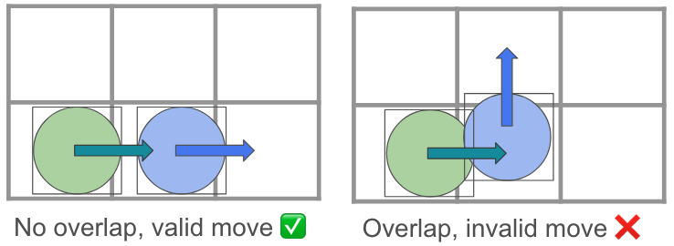 

### Delays

This competition models execution uncertainty and safety-aware execution. Robots may experience execution delays. A delay means the robot temporarily cannot make progress, even if it has a valid planned action. Delays do not change the planned action itself. At one tick, each agent may have a probability of p to have delay events. When a delay event happens to an agent, that agent is forced to STOP (Wait) at the current location for a number of clock ticks, meaning the robot’s action progress is paused. Note when an agent is in delay, it will not trigger a delay event again.

1. Receive and Process a Plan from Planner

The planner does not send a single action per robot every executor tick. Instead, it periodically sends a plan, which consists of a short-horizon sequence of high-level (planner-level) actions for each robot.

When a new plan is received, the executor will decide to process it into the “staged action queue” for each agent. For processing the new plan, it means the executor has to decide how to update the staged action queue with the new plan. Note, this processing can decide to only adopt partial plans (cut from the middle) or replace the (entire or partial) old staged actions with the new plan, but it should not modify (i.e., delete/insert/modify actions or shuffle orders of actions, wait exclude) the staged actions and the new plan itself. 

After processing the new plan, the executor also needs to provide a “predicted state” for each agent. The predicted state represents a prediction of the agent state at the end of the current plan execution,  which gives the starting states for the planner to start next.  Note these predicted states are only an estimate, because actual execution may differ due to GO/STOP decisions, collision avoidance overrides, and delays.

2. Execution policy: GO / STOP
The executor runs every tick and applies an execution policy that maps “planned action” to “what actually happens this tick”.
Given the plans (sequence of actions) from the planner, at every tick, the execution policy decide:

- GO: allow the robot to advance one tick of its current committed action (progress increases)
- STOP: do not allow progress this tick (progress does not increase).
- 
If the executor issues “GO” to an agent, the agent will try to execute the first action on the staged action queue by incrementing the counter, and once the action is completed (counter accumulates to max and resets to zero), this action will be removed from the top of the queue.

## Tasks, Errands and Assignments 

An **errand** is a request for a specific robot to visit a particular **target location** on the grid. An errand is completed when the assigned robot arrives at the target location.

A **task** is a request for a specific robot to complete an ordered sequence of errands. 
- A task is **open** if one or more errands in the sequence have been completed. 
- A task is **closed** and no longer assigned when all the errands in the sequence have been completed. 
- Each robot has at most one open task. 

Tasks can be **assigned** to any robot. 
- Once open, a task cannot be re-assigned. 
- When a task is completed, more tasks are **revealed**.

The **objective** is to complete as many tasks as possible by a given timestep.
Effective task assignment and path planning are crucial for achieving strong
performance. 

### Illustrative Example:

1. There is a team of three robots, coloured blue, yellow, and green. The cells
   coloured pink represent potential errands: locations that might need to
   visited by assigned robots.

   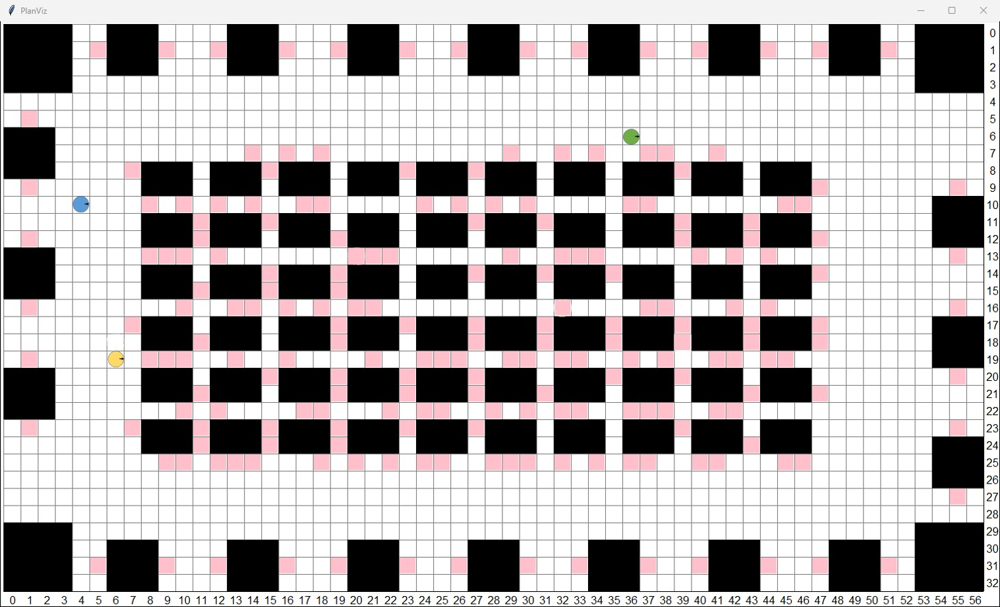

2. Each robot is assigned a task (an ordered sequence of errands). In the
   image, the blue robot is assigned a task consisting of five errands, while
   the yellow and green robot are each assigned a task consisting of three
   errands. The arrows indicate the planned paths, which robots must follow 
   to complete their errands.

   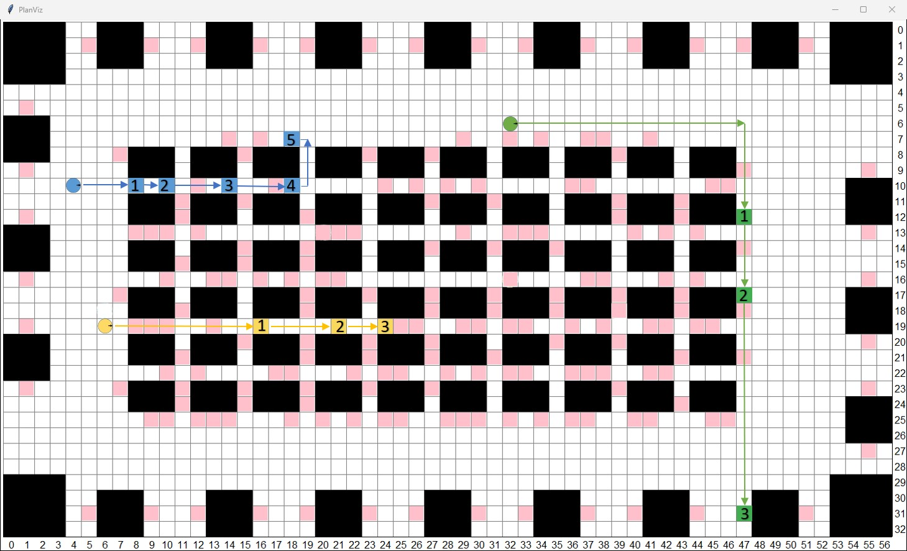

3. The yellow robot has just completed the last errand in its assigned
   sequence. This task is now closed and the yellow robot becomes unassigned.
   The blue robot has one errand remaining. This task is considered open. The
   green robot is still trying to complete its first assigned errand. This task
   is neither open nor closed and could be re-assigned.

   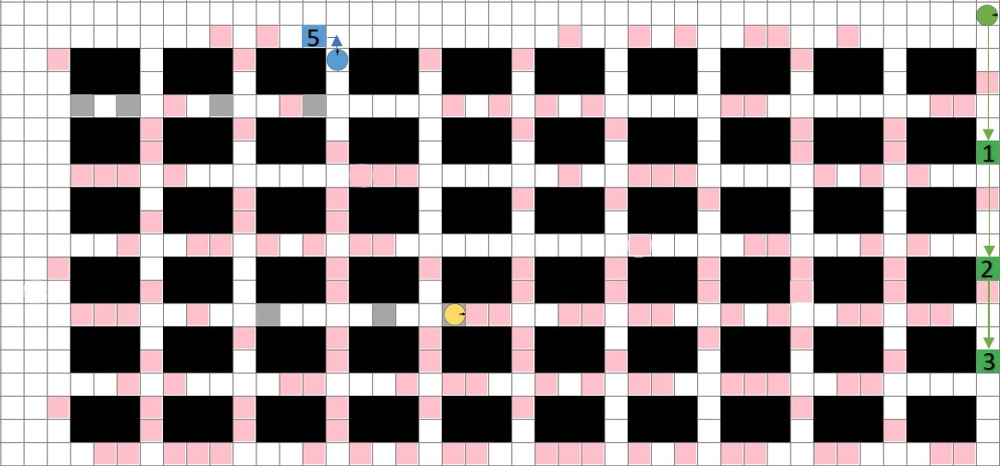

4. A new task is revealed and assigned to the yellow robot. This task contains four errands.
The robots need to finish as many tasks as possible, before a maximum timestep is reached. 
The total number of remaining (un-revealed) tasks is infinite. 

   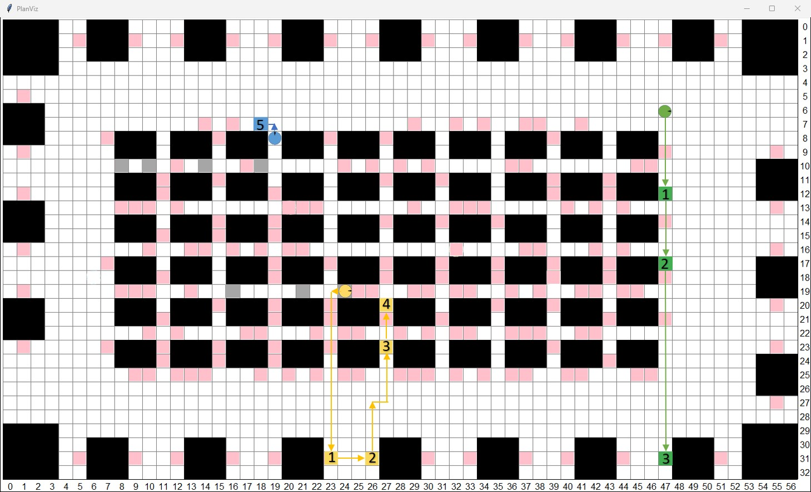

 

## The Central Controller

The central controller is responsible for the correct operation of robots in the environment. It tracks the current states of all robots, validates collisions, and advances the simulation forward in time. It also tracks task assignments and the progress robots are making toward completing their assigned tasks.
A key feature of this competition is that decision-making happens at two different time scales:

- **Planning updates (slower)**: the controller periodically communicates with the planner/task scheduler and receives updated plans.
- **Execution ticks (faster)**: the controller advances the world every tick and consults the executor to safely realize (or temporarily pause) the planned motions, while also injecting delays.

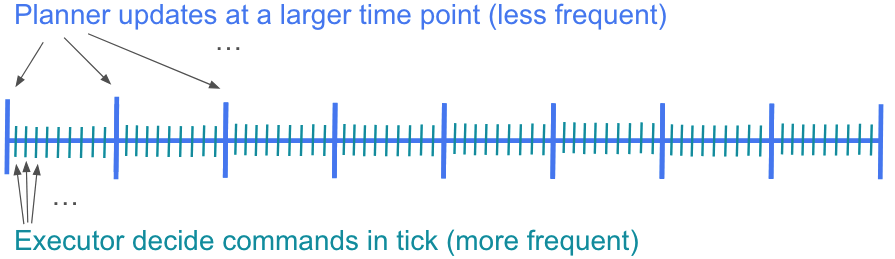

### Path Planner

To determine the intended actions for each robot, the controller relies on a component known as the **path planner**. The controller does **not** require a fresh decision every execution tick. Instead, it contacts the planner **periodically** (every multiple execution ticks), with a fixed time budget per call.

What the planner returns  
The planner returns a **plan** for each robot: a short-horizon sequence of grid-level actions from the set Move Forward (into the adjacent cell in front), Rotate 90 degrees clockwise, Rotate 90 degrees counter-clockwise and Wait.

Important: the planner does not output micro-actions or fractional movements. A “Forward” action is still the planner’s high-level intent to move to the next cell; the controller/executor handles multi-tick realisation internally.

### Task Scheduling

To determine which robot is assigned which task, the controller relies on a
component known as the **task scheduler**, which you must implement (for the
Task Scheduling track and the Combined track). The role of the scheduler is to
specify a valid next task (or no task) for each robot at each planning update. 
An assignment is valid if every assigned task is a revealed task which has 
not been previously opened or closed by another robot. 

When the controller call the planning entry, the task scheduler is first called to determine the schedule, given:

- The agent predicted states (starting state for this planning episode)
- New tasks and new free agents (agents finished their previously assigned tasks) from the last planning episode (between the time the planner last called and now).

It returns the task schedule for each agent, which is then passed to the planner to plan the path accordingly. 

Below is an example of task assignments. The top row represents the task pool, which contains six tasks. Task T1, shaded in gray, is finished. Task T2, shaded in orange, is assigned to an agent but remains unfinished. Tasks T3, T4, and T5, shaded in cyan, are revealed but unassigned, while task T6, shaded in green, is unrevealed. The second row shows the agents, with gray-shaded agents currently working on unfinished tasks and cyan-shaded agents available for assignment. The left side illustrates an invalid assignment due to the following issues:

1. Task T5 is assigned to both agents A3 and A5, but each task can only be assigned to one agent.
2. Task T2, which is already assigned to another agent but not yet finished, is incorrectly assigned to agent A2.
3. Task T6 is assigned to an agent, which is invalid because tasks that are already completed, unrevealed, or nonexistent cannot be assigned.

   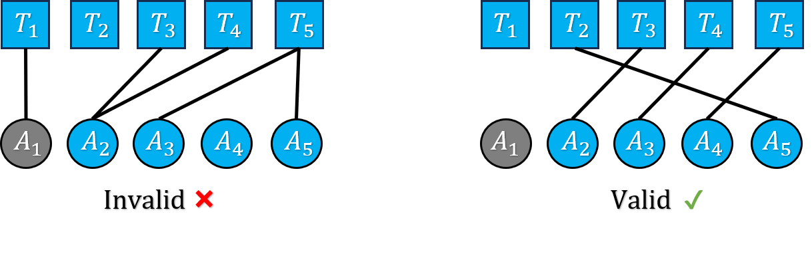

If the Task Scheduler does not complete in time, or if the proposed assignment
is invalid, the previous valid assignment is retained.

Effective task assignment is crucial: for optimising the use of available
resources (the robots) and for maximising the number of task completions. 

### Executor

To safely apply a plan in the physical simulation under uncertainty, the controller relies on an **executor** that is called **every execution tick**.

1. Receive and Process a Plan from Planner

The first role of the executor is to process the planned actions. As illustread above, the planner does not send a single action per robot every executor tick. Instead, it periodically sends a plan, which consists of a short-horizon sequence of high-level (planner-level) actions for each robot.

When a new plan is received, the executor will decide to process it into the “staged action queue” for each agent. For processing the new plan, it means the executor has to decide how to update the staged action queue with the new plan. Note, this processing can decide to only adopt partial plans (cut from the middle) or replace the (entire or partial) old staged actions with the new plan, but it should not modify (i.e., delete/insert/modify actions or shuffle orders of actions, wait exclude) the staged actions and the new plan itself. 

After processing the new plan, the executor also needs to provide a “predicted state” for each agent. The predicted state represents a prediction of the agent state at the end of the current plan execution,  which gives the starting states for the planner to start next.  Note these predicted states are only an estimate, because actual execution may differ due to GO/STOP decisions, collision avoidance overrides, and delays.

2. Progress the Staged Action Queue

Another executor’s role is to decide what actually happens at the current tick, given:

- The currently staged plan from the planner,  
- The current robot states (including robots mid-action),  
- Delay situation at the last tick step (including if agents are in delay, and the time range it may delay for). Note delays at the current tick are revealed at the next tick. For example, at tick=0, the agents don’t know whether they will have a delay, and this delay information will be revealed at tick=1.

At each tick, it outputs a GO or STOP command for each agent to execute next.

### Timeout Control and Collision Avoidance

The central controller monitors time elapsed since the start of execution
(also known as **wall clock time**). Time continues to pass while scheduler,
planner, and executor are running.

After a predetermined simulation horizon, the controller stops and the problem
instance is finished. Careful time budgeting across scheduling, planning, and
execution is essential for strong performance.

**What happens if the planner is late**  
If the planner does not return in time, the controller continues executing by asking the next moves with the current staged actions. If no actions are left in the staged action queue,  agents will wait in place.

**What happens if the task scheduler is late**

If the Task Scheduler does not complete its computation in time, or if the proposed assignment is invalid, the existing assignment (from the previous scheduling update) is kept as the current assignment.

**What happens if the executor is late**

If the executor does not return in time when processing the new plan, it will be treated the same as a planner timeout, which means the controller will try to move agents by calling the executor to decide the next moves during the timeout.

If the executor does not return in time when deciding the GO/STOP commands at each time tick, the controller will issue wait actions for each agent until the executor returns.

**Controller’s perspective on timeout**

Note that because the controller is simulating in real-time, the controller will advance the timesteps/ticks even when the timeout (agent may incur wait or continue executing depending on the situations as illustrated above)

**What happens if the plan has collisions**

First, the controller only validates the plan after the executor returns instructions for each agent at each time tick, which means we do not check collisions immediately after the planner returns. For collisions, when a collision is detected, it may include the collisions caused by:

- The plan from the planner contains collisions  
- The plan from the planner does not contain collisions, but the executor gives collide instructions. For example, one agent may have to wait due to delays, and collisions will happen if there is another agent trying to occupy the same location where the delayed agent stays, and the executor tries to move both agents.

We do not distinguish between the two types of collisions above. Instead, given an execution instruction from the executor, the controller translates it into agent actions, and if any of the collision is detected, the colliding agents will stop and stay at their current locations. This process also propagates until no agents are in collision at the current time tick.

**What happens if the task schedule is invalid**

Similar to handling collisions, if the task schedule is invalid, the controller will set the invalid task schedule to \-1. That means, those agents with invalid schedules will have no task schedule, and the valid schedule will be kept.

Please refer to our competition
[Start-Kit](https://github.com/MAPF-competition/Start-Kit) for more details
about interactions between scheduler, planner, and executor, and detailed
behaviour of the default implementations.
