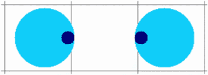
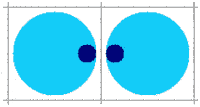
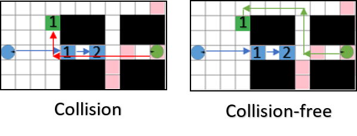

## Problem Overview 

A team of robots works together in a simplified grid environment. Their job is
to run infinite errands, which they accomplish by visiting different locations
on the grid. Sometimes errands must be completed in a specific order. A
sequence of such errands is called a task. The [objective](./evaluation) is to
complete as many tasks as possible, as quickly as possible, until time runs
out. 

These types of problems are the core challenge in many real-world applications,
including warehouse logistics, multi-robot manufacturing, multi-agent computer
games and many more besides. The image below shows an example from a warehouse
domain, which we call **fulfilment**. 

 

 

On this page you can find further descriptions of the the problem setting, the
robot model, and the centralised controller that is responsible for plan
validation and execution. More granular technical details are available in
our competition [Start-Kit](https://github.com/MAPF-competition/Start-Kit)

## Robots and Their Environment 
The **environment** is a grid map comprised of traversable and non-traversable cells
(obstacles). It is deterministic, fully observable, and known ahead of time.
Time is divided into unit-sized time steps. 

Each **robot** occupies a single grid cell and has a designated orientation called
`Forward`. The planner-level actions are:
- Move Forward, into an adjacent grid cell
- Rotate 90 degree clockwise
- Rotate 90 degrees counter-clockwise
- Wait at the current location.

In the 2026 competition system, actions are executed through a simulator that
tracks progress over multiple execution ticks. In particular, `Forward` and
rotations may require multiple ticks to complete (via an internal action
counter), and delays can temporarily force a robot to wait.
These execution delays are a new competition feature compared with older
competition settings.

An **action request** is feasible if it can be executed safely in the
continuous motion model used by the simulator. Safety is checked by geometric
overlap of robots and obstacles over a tick (swept collision checking), rather
than only discrete conflict rules. At the same time, both planner and executor
should avoid the classic discrete conflicts used in MAPF:

- Vertex collision: two robots attempt to move to the same location at the same time.
- Edge collision: two robots traverse the same edge from opposite directions at the same time.

| `Forward` |  `Rotate` |
|:---:|:---:|
|  |  |

| `Vertex Collision` |  `Edge Collision` |
|:---:|:---:|
|  |   |

## Tasks, Errands and Assignments 

An **errand** is a request for a specific robot to visit a particular **target location** on the grid. An errand is completed when the assigned robot arrives at the target location.

A **task** is a request for a specific robot to complete an ordered sequence of errands. 
- A task is **open** if one or more errands in the sequence have been completed. 
- A task is **closed** and no longer assigned when all the errands in the sequence have been completed. 
- Each robot has at most one open task. 

Tasks can be **assigned** to any robot. 
- Once open, a task cannot be re-assigned. 
- When a task is completed, more tasks are **revealed**.

The **objective** is to complete as many tasks as possible by a given timestep.
Effective task assignment and path planning are crucial for achieving strong
performance. 

### Illustrative Example:

1. There is a team of three robots, coloured blue, yellow, and green. The cells
   coloured pink represent potential errands: locations that might need to
   visited by assigned robots.

   

2. Each robot is assigned a task (an ordered sequence of errands). In the
   image, the blue robot is assigned a task consisting of five errands, while
   the yellow and green robot are each assigned a task consisting of three
   errands. The arrows indicate the planned paths, which robots must follow 
   to complete their errands.

   

3. The yellow robot has just completed the last errand in its assigned
   sequence. This task is now closed and the yellow robot becomes unassigned.
   The blue robot has one errand remaining. This task is considered open. The
   green robot is still trying to complete its first assigned errand. This task
   is neither open nor closed and could be re-assigned.

   

4. A new task is revealed and assigned to the yellow robot. This task contains four errands.
The robots need to finish as many tasks as possible, before a maximum timestep is reached. 
The total number of remaining (un-revealed) tasks is infinite. 

   

 

## The Central Controller

The central controller is responsible for the correct operation of robots in
the environment. It tracks the current positions of all robots and it issues
commands, to have the robots execute specific actions. The controller also
tracks the current assignment of each robot, and the progress that robots are
making toward completing their assigned tasks.

### Two-Rate Control Loop

The 2026 controller runs as a **two-rate loop**:

1. **Planning update (slower loop):**
    - The system syncs a planning snapshot into `SharedEnvironment`.
    - `Entry::compute(...)` runs scheduler and planner, returning:
       - a proposed task schedule (agent -> task), and
       - a **multi-step plan** (a sequence of planner actions per agent).
    - The executor then processes this new plan and updates per-agent
       **staged actions** (action queues for upcoming ticks).

2. **Execution tick (faster loop):**
    - Every tick, the executor outputs per-agent `GO` / `STOP` commands.
   - The simulator combines command + staged action, applies execution delays and safety
       checks, and advances one tick.

Planning and execution are decoupled, so the system can keep executing staged
actions while a new plan is being computed.

The following sequence diagram illustrates how the planner, simulator, and
executor interact during planning updates and execution ticks.

   

### Planner and Executor Roles

The **planner** (Combined track) provides multi-step,
grid-level intent (`FW`, `CR`, `CCR`, `W`) for each robot.

The **executor** (Execution / Combined tracks) decides at each tick whether each
robot should `GO` or `STOP`, based on current state and staged actions, and is
responsible for converting received plans into staged executable actions.

The executor should also prevent unsafe progress, including potential
vertex/edge conflicts and other unsafe motions detected by the simulator.

If a robot has no staged actions, it waits (or is stopped) until new actions
are staged.

In the following example, we have illustrated two different scenarios:

- **Unsafe request at execution:** the simulator may override requested movement
   to wait when safety checks reject the motion, including conflict-prone cases.

- **Safe coordinated execution:** plans and executor decisions keep robots
   progressing with fewer forced waits and delays.

Effective path planning is crucial, for completing assignments as efficiently as possible. 

   

### Task Scheduling

To determine which robot is assigned which task, the controller relies on a
component known as the **task scheduler**, which you must implement (for the
Task Scheduling track and the Combined track). The role of the scheduler is to
specify a valid next task (or no task) for each robot at each planning update. 
An assignment is valid if every assigned task is a revealed task which has 
not been previously opened or closed by another robot. 

Below is an example of task assignments. The top row represents the task pool, which contains six tasks. Task T1, shaded in gray, is finished. Task T2, shaded in orange, is assigned to an agent but remains unfinished. Tasks T3, T4, and T5, shaded in cyan, are revealed but unassigned, while task T6, shaded in green, is unrevealed. The second row shows the agents, with gray-shaded agents currently working on unfinished tasks and cyan-shaded agents available for assignment. The left side illustrates an invalid assignment due to the following issues:

1. Task T5 is assigned to both agents A3 and A5, but each task can only be assigned to one agent.
2. Task T2, which is already assigned to another agent but not yet finished, is incorrectly assigned to agent A2.
3. Task T6 is assigned to an agent, which is invalid because tasks that are already completed, unrevealed, or nonexistent cannot be assigned.

   

If the Task Scheduler does not complete in time, or if the proposed assignment
is invalid, the previous valid assignment is retained.

Effective task assignment is crucial: for optimising the use of available
resources (the robots) and for maximising the number of task completions. 

### Time Tracking and Planning Horizon

The central controller monitors time elapsed since the start of execution
(also known as **wall clock time**). Time continues to pass while scheduler,
planner, and executor are running.

Planning updates are soft-time-limited: if planning runs late, simulation keeps
executing with previously staged actions until planning returns. Likewise,
executor callbacks should stay lightweight to avoid losing effective control
time.

After a predetermined simulation horizon, the controller stops and the problem
instance is finished. Careful time budgeting across scheduling, planning, and
execution is essential for strong performance.

Please refer to our competition
[Start-Kit](https://github.com/MAPF-competition/Start-Kit) for more details
about interactions between scheduler, planner, and executor, and detailed
behaviour of the default implementations.
