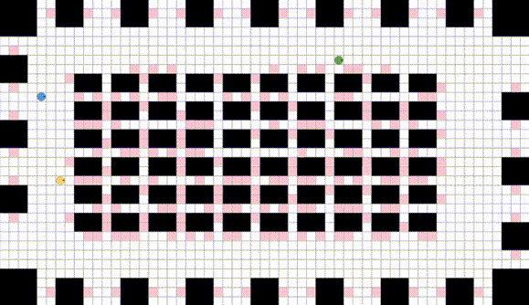
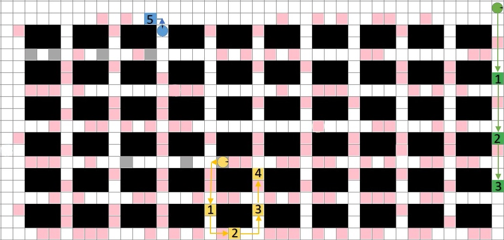

## Problem Overview 

In this competition a team of robots is tasked with running an infinite number of errands in a grid environment. These types of problems are the core challenge in a variety of real-world application settings, such as warehouse logistics, multi-robot manufacturing and multi-agent computer games. 

On this page we give an overview of the problem model, the robot model, and the centralised controller that coordinates the execution of your computed plans.The figure above shows a typical example of a problem instance in a warehouse domain we call **fulfilment**.

## Robots and Their Environment 
Each grid map is deterministic, fully observable and known ahead of time. All robots move in parallel. Time is divided up into discrete time steps. 

At each timestep, a robot can execute one of the following actions: 
> - move forward into an adjacent grid cell
> - rotate 90 degree clockwise 
> - rotate 90 degrees counter-clockwise
> - wait at its current location.

| `Moving Forward` |  `Rotate` |
|:---:|:---:|
|  |   |

An action is considered valid (or feasible) if the robot can execute that action without colliding with static obstacles in the environment or with other moving robots. Each valid action has a duration of exactly one timestep. 

We consider two types of collisions that can occur between pairs of agents.:
> - Vertex collision: two agents occupy the same location at the same time.
> - Edge collision: two agents traverse the same edge from opposite directions at them same time.

| `Vertex` |  `Edge` |
|:---:|:---:|
|  |   |

## Tasks and Errands  

An **errand** is a request requiring a specific robot to visit a particular **target location** on the grid. An errand is completed when the assigned robot arrives at the designated location.

A **task** may consist of multiple errands, with the number of errands per task \( N \) ranging from \([minEPT, maxEPT]\), where \( minEPT \) and \( maxEPT \) are the minimum and maximum number of errands per task, respectively. When a task is revealed, the total number of errands, their sequence, and the details of each errand are disclosed. A task is completed when the assigned robot has completed all errands in the specified order.

**The objective** is to complete as many tasks as possible within the given time frame. The order of errands within a task is important and must be followed. Effective task assignment and path planning are crucial for optimal performance.

Below is an example:

1. Initially, there are three agents colored blue, yellow, and green. The cells colored pink represent potential errands that need to be assigned to the agents.

   

2. Each agent is assigned a task. In the image, the blue agent is assigned a task consisting of five errands, while the yellow and green agents are each assigned a task consisting of three errands. The arrows indicate the possible planned path for each agent, who must follow the given sequence order to complete the errands.

   

3. After completing all the assigned errands, the task of the yellow agent is considered finished.

   

4. Once a task is completed, the yellow agent is assigned a new task containing four errands by the controller.

   

## The Central Controller

The central controller is responsible for the correct operation of robots in the environment. It tracks the current position of all robots and issues commands to them, dictating their next actions.

### Planner and Path Planning

To determine which command to issue to each robot, the controller relies on a component known as **the planner**, which you must implement. The controller calls the planner at each timestep. The planner's role is to return one valid command for each robot. If the planner fails to provide a valid set of commands (one for each robot) or does not complete its computation in time, the controller instructs all robots to **wait in place** until the next timestep or until the planner finishes deliberating.

In the following example, we have illustrated two different scenarios:

- **Collision Path:**  The collision path shows a scenario where two robots’ routes intersect, leading to a potential collision. This highlights the importance of effective path planning, as failure to account for other robots' movements can result in collisions, delays, or even the failure of the robots to complete their tasks.

- **Collision-Free Path:** In contrast, this path is carefully planned so that the robots avoid each other entirely, finishing their tasks without any conflicts. 

   

### Task Assignment

In the updated version, the central controller also manages **task assignment**. This involves assigning tasks, which consist of multiple errands, to the appropriate robots. Task assignment is crucial for ensuring that each robot has a specific set of errands to complete, optimizing the use of available resources and minimizing delays.

### Time Tracking and Planning Horizon

The central controller monitors the elapsed time since the start of the task (also known as **wallclock time**). Time continues to pass while the planner is deliberating. After a predetermined period, known as the **planning horizon**, the central controller stops, and the task is considered complete.

This new system ensures that the controller not only handles path planning through the planner but also efficiently assigns tasks to robots, balancing both responsibilities to achieve optimal performance.

