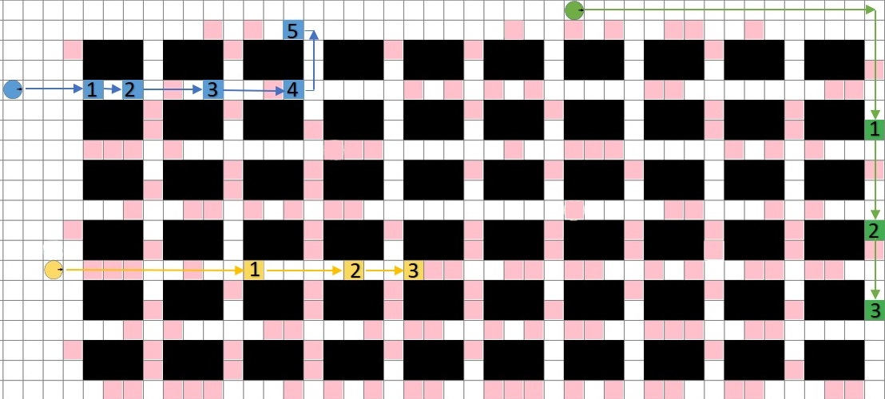

## Problem Overview 

A team of robots works together in a simplified grid environment. Their job is
to run infinite errands, which they accomplish by visiting different locations
on the grid. Sometimes errands must be completed in a specific order. A
sequence of such errands is called a task. The [objective](./evaluation) is to
complete as many tasks as possible, as quickly as possible, until time runs
out. 

These types of problems are the core challenge in many real-world applications,
including warehouse logistics, multi-robot manufacturing, multi-agent computer
games and many more besides. The image below shows an example from a warehouse
domain, which we call **fulfilment**. 

 

 

On this page you can find further descriptions of the the problem setting, the
robot model, and the centralised controller that is responsible for plan
validation and execution. More granular technical details are available in
our competition [Start-Kit](https://github.com/MAPF-competition/Start-Kit)

## Robots and Their Environment 
The **environment** is a grid map comprised of traversable and non-traversable cells
(obstacles). It is deterministic, fully observable, and known ahead of time.
Time is divided into unit-sized time steps. 

Each **robot** occupies a single grid cell and has a designated orientation called
`Forward`. Each timestep a robot can execute a single action, in parallel
with all other robots. Each action has a duration of exactly one timestep. 
The available actions (see illustration) are as follows:
- Move Forward, into an adjacent grid cell
- Rotate 90 degree clockwise
- Rotate 90 degrees counter-clockwise
- Wait at the current location.

An **action** is valid (or feasible) if the robot can execute that action
without colliding with obstacles in the environment or with other moving
robots. There are two types of collisions (see illustrations) which can occur between two robots:

- Vertex collision: two robots attempt to move to the same location at the same time.
- Edge collision: two robots traverse the same edge from opposite directions at the same time.

| `Forward` |  `Rotate` |
|:---:|:---:|
|  |  |

| `Vertex Collision` |  `Edge Collision` |
|:---:|:---:|
|  |   |

## Tasks, Errands and Assignments 

An **errand** is a request for a specific robot to visit a particular **target location** on the grid. An errand is completed when the assigned robot arrives at the target location.

A **task** is a request for a specific robot to complete an ordered sequence of errands. 
- A task is **open** if one or more errands in the sequence have been completed. 
- A task is **closed** (completed) when all the errands in the sequence have been completed. 
- Each robot has at most one open task. 

Tasks can be **assigned** to any robot. 
- Once open, a task cannot be re-assigned. 
- When a task is completed, more tasks are **revealed**.

The **objective** is to complete as many tasks as possible by a given timestep.
Effective task assignment and path planning are crucial for achieving strong
performance. 

### Illustrative Example:

1. There is a team of three robots, coloured blue, yellow, and green. The cells
   coloured pink represent potential errands: locations that might need to
   visited by assigned robots.

   

2. Each robot is assigned a task (an ordered sequence of errands). In the
   image, the blue robot is assigned a task consisting of five errands, while
   the yellow and green robot are each assigned a task consisting of three
   errands. The arrows indicate the planned paths, which robots must follow 
   to complete their errands.

   

3. The yellow robot has just completed the last errand in its assigned sequence. 
This task is now closed. The blue robot has one errand remaining. This task is
open. The green robot is still trying to complete its first assigned errand. 
This task is neither open nor closed and could be re-assigned.

   

4. A new task is revealed and assigned to the yellow robot. This task contains four errands.
There are an infinite number of un-revealed tasks. The robots need to finish as many tasks as 
possible, before a maximum timestep is reached. 

   

 

## The Central Controller

The central controller is responsible for the correct operation of robots in
the environment. It tracks the current positions of all robots and it issues
commands, to have the robots execute specific actions. The controller also
tracks the current assignment of each robot, and the progress that robots are
making toward completing their assigned tasks.

### Planner and Path Planning

To determine which command to issue to each robot, the controller relies on a component known as the **path planner**, which you must implement (for the Path Planning Track and the Combined Track). The controller calls the planner at each timestep. The planner's role is to return one valid command for each robot at each timestep. If the planner fails to provide a valid set of commands (one for each robot) or does not complete its computation in time, the controller instructs all robots to **wait in place** until the next timestep.

In the following example, we have illustrated two different scenarios:

- **Path with Collision:**  The "collision" figure shows a scenario where two
  robots’ routes intersect at timestep 5. Failing to account for the movements
  of other robots leads to delays. Without a feasible plan at timestep 5, the 
  controller tells all robots to wait.

- **Collision-Free Path:** The "collision-free" figure shows a carefully
  planned situation where robots avoid each other. Both robots finish their
  tasks without any delays.

Effective path planning is crucial, for completing assignments as efficiently as possible. 

   

### Task Scheduling

To determine which robot is assigned which task, the controller relies on a
component known as the **task scheduler**, which you must implement (for the
Task Scheduling Track and the Combined Track). The role of the scheduler is to
compute a valid next task for each robot at each timestep. An assignment is
valid if every task specified is a revealed task and if it has not been opened
or closed by another robot.

If the Task Scheduler does not return a valid assignment, or if it does not
complete its computation in time, the existing assignments (valid at the last
timestep) are retained.  

Effective task assignment is crucial: for optimising the use of available
resources (the robots) and for maximising the number of task completions. 

### Time Tracking and Planning Horizon

The central controller monitors the elapsed time since the start of the task
(also known as **wall clock time**). Time continues to pass while the planner
is deliberating. 

At the end of each timestep, the planner and scheduler must return valid plans
and valid assignments. In every track, participants decide how to allocate
available time to both planning and scheduling. Careful management of available
time is essential for strong performance. 

After a predetermined period, known as the **planning horizon**, the central 
controller stops, and the problem is considered finished.

Please refer to our competition
[Start-Kit](https://github.com/MAPF-competition/Start-Kit) for more details
about interactions between the planner and scheduler and descriptions of
algortihmic behaviour for the Default Planner (used in the Task Scheduling
Track) and the Default Scheduler (used in the Path Planning track).
