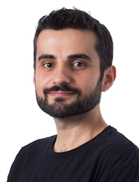

## Goals of the Competition

The League of Robot Runners is a competition series to foster and advance research areas in the area of Multi-Agent Path Finding. 
LoRR aims to: 

> - identify the core challenges for solving MAPF;
> - develop suitable benchmark instances;
> - evaluate algorithmic performance in the area and;
> - track the state-of-the-art.
 
The competition provides a standardised system to develop, evaluate, and compare algorithmic techniques. 
[Submissions](https://github.com/MAPF-Competition/Code-Archive), [solutions and problem instances](https://github.com/MAPF-Competition/Benchmark-Archive) from the competition are open sourced, to lower barriers, promote dissemination and enable further advancements.

## Competition Series
### 2023 Competition
The first round of the competition was held in 202 and received a total of **825 submissions** from **25 teams worldwide**! The competition identifies two main challenges:

> - **Turn actions:** 
        In MAPF, robots are often modelled as rotationally invariant agents with unit action costs. This model is disconnected from many applications, where turning 
        actions can substantially increase achieved execution costs.
> - **Online lifelong problem:**
        In MAPF, the problem is one-shot and 
        solved entirely offline. 
        Yet real applications are *lifelong* and *online*:  agents receive new tasks upon arrival and they must
        be constantly planned and replanned, 
        so as to maximise a throughput objective.

For more details about the setup, results, and resources of the 2023 competition, please visit the [2023 Competition Snapshot Site](https://2023.leagueofrobotrunners.org/).

### 2024 Competition
In 2024, the competition will introduce new tracks with path planning and **task assignments** to reflect the challenges faced by real-world applications.

Fill your email in the [My Submission](./setting) page to subscribe to our newsletter and receive updates about the upcoming competition!

<!-- what we do in 2024 -->

## Organisers

### Competition Chairs

|  |  |  |  |  |
| ------------------------------------------------------------------------ | ---------------------------------------------------------------- | ------------------------------------------------------------- | ------------------------------------------------------------------- | - |
| **Daniel Harabor** Monash University                                 | **Sven Koenig** University of Southern California             | **Cathy Wu** Massachusetts Institute of Technology          | **Jingjin Yu** Rutgers University                                | |

### Organising Committee

|  |  |  |  |   | 
| ------------------------------------------------------------------------ | ------------------------------------------------------------- | ---------------------------------------------------------- | ---------------------------------------------------------------- | ----------------------------------------------------------- |
| **Shao-hung Chan** University of Southern California                 | **Zhe Chen** Monash University                             | **Teng Guo** Rutgers University                         | **Yue Zhang** Monash University                            | **Han Zhang** University of Southern California           |

### Advisors

|  |  |    |    |    |
| ------------------------------------------------------------------------------ | --------------------------------------------------------------------- | - | - | - |
| **Kostas Bekris** Rutgers University                                       | **Federico Pecora** Amazon Robotics                                |  |  | |