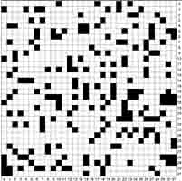
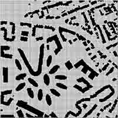
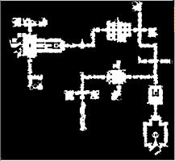
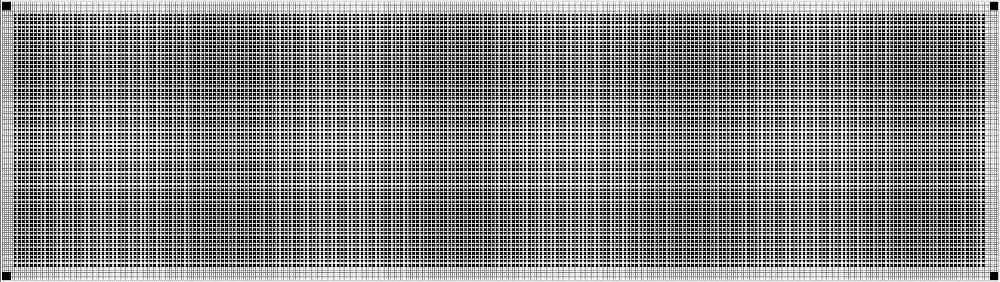

## Evaluation Process 

Submissions will be evaluated using an AWS cloud compute instance with the following specifications:

> - AMD EPYC 7R13 Processor with 32 vCPUs
> - 128 GiB Memory
> - Nvidia A10G GPU

The evaluation server deploys participant code into an official [PyTorch Docker
container](https://hub.docker.com/r/pytorch/pytorch), which provides necessary
software and drivers for GPU- and CPU-based compute. 

Submissions will be evaluated on a range of distinct grid-map domains. Each
problem instance on each map features a different number of agents and a
different number of tasks. The maps are [available for
download](https://github.com/MAPF-Competition/Start-Kit/tree/main/example_problems)
and analysis . The problem instances (used in the main round) are hidden until
after the competition.

The evaluation process has two stages: offline preprocessing, where participants
can load and prepare auxiliary data, and online planning, where participants
try to complete as many tasks as possible, up to a fixed time limit.

Prizes are available for distinguished performance in three distinct tracks. 

## Domains

>| |   |   |
>|:---:|:---:|:---:|
>||| |
>|`Random (random-32-32-20)`| `City (Paris)`|`Game (brc202d)`|
>|a 32 by 32 map with 20% random obstacles.| a 256 by 256 map representing part of the city of Paris.|a 481 by 530 map from computer games.|

>| |
>|:---:|
>||
>|`Warehouse`|
>|a 500 by 140 map representing synthetic automated fulfilment centre.|

>| |
>|:---:|
>||
>|`Sortation`|
>|a 500 by 140 map representing synthetic automated sortation centre.|

## Offline Preprocessing

During the preprocessing stage, the current map is revealed. You then have an opportunity to analyse the map and compute auxiliary data before proceeding to the evaluation stage (e.g., initialise data structures, load models, etc). Preprocessing time is limited to 30 minutes per map. Nothing you do at this stage will be counted into your final score.

## Online Planning

After preprocessing, your submission is evaluated on a set of (a priori
unknown) tasks. The starting locations of the robots and an initial set of
tasks are revealed. As robots complete tasks, more will be revealed. 

During evaluation, time progresses at a rate of 1 second per timestep. Your
submission will be evaluated for up to 5000 seconds on each map. Your job is to
complete as many tasks as possible, before a time limit is reached. 

There are three evaluation tracks: 
- **Path Planning** 
- **Task Scheduling**
- **Combined** (Path Planning + Task Scheduling)

### Task Scheduling

In this track, participants are responsible for assigning revealed tasks to
robots. At each timestep, your scheduler must return a valid task assignment
(including no assignment) for every robot. The schedule is then realised by a
`default path planner`, which decides what paths robots will take through the
environment to complete their tasks. 

At every timestep, your scheduler must compute a valid assignment for the
revealed, unallocated tasks. While you can take as long as needed to make
scheduling decisions, time continues to elapse during deliberation. Failure to
compute an assignment results in all robots waiting in place until the next
planning episode.

### Planner Track
In the Planner Track, participants must implement their own planner, which is responsible for planning the paths for the robots. The **default task scheduler** will be used in this track.

During the planning stage, the initial locations of the robots are revealed, and tasks—comprising sequences of errands—are assigned, one to each robot, by the default scheduler. Time progresses at a rate of 1 second per timestep, and your planner will be evaluated for up to 5000 seconds on each map.

At every timestep, your planner must compute the next valid action for each robot. While you can take as long as needed for planning, time continues to elapse during deliberation. Failure to compute the next valid action for every robot, or deliberating for longer than 1 second, will result in all robots waiting in place until the next planning episode.

### Combined Track
In the Combined Track, participants can modify **both the task scheduler and the path planner**. Both components are evaluated
together, which gives maximum flexibility over how the problem solved. 

### Scoring and the Virtual Best

Performance in each track is determined relative to a **virtual best**
baseline. The virtual best comprises all best known solutions for every
evaluation instance, as computed by any submission. For a given submission, 
the score is computed using the following formula:

>
> $$\mbox{Submission score} = \displaystyle \sum^{max}_{i=0}{\frac{\mbox{Your number of tasks finished for instance }i}{\mbox{best number of tasks finished for instance }i}}$$

 

## Track Prizes

Each track has a separate
leaderboard. Participants submitting to the Combined track compete for the
grand prize. Other participants (i.e., Path Planning only or Task
Scheduling only) compete for track prizes. 

Single-track solutions are further ranked and evaluated on the Combined
leaderboard (i.e. everyone is eligible for the grand prize). 
A separate prize, also available to participants in any track, is **Line Honours**. This prize is
awarded to the team which contributes the largest number of solutions to the
virtual best solver. 

In addition to the three tracks, we keep track of who contributed the largest number of solutions to the virtual best. The submission with largest number of best solutions at the end of the competition is declared as the winner of the Line Honours prize. 

