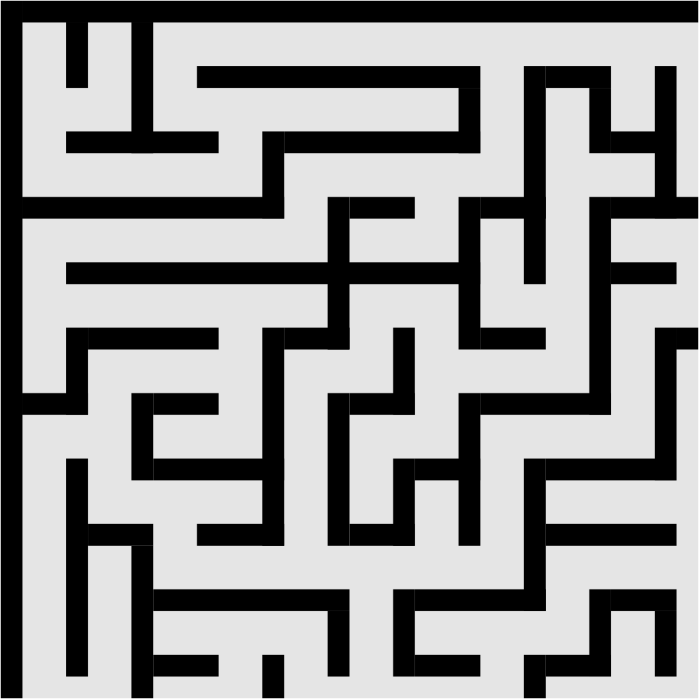
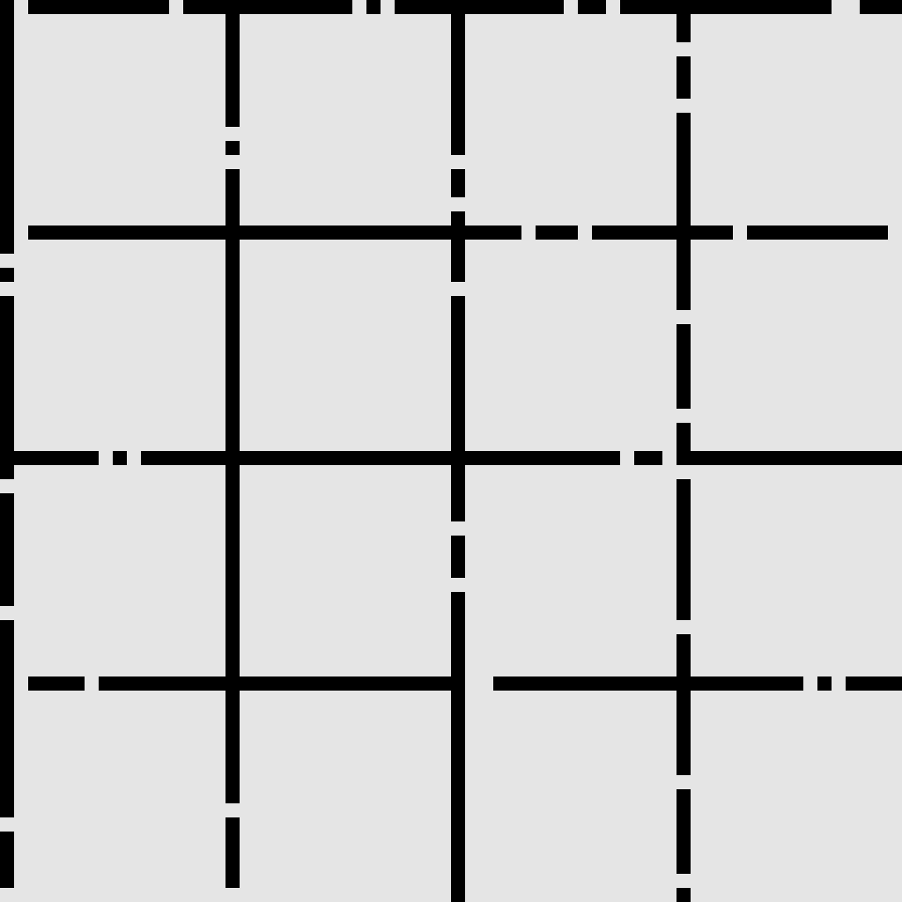
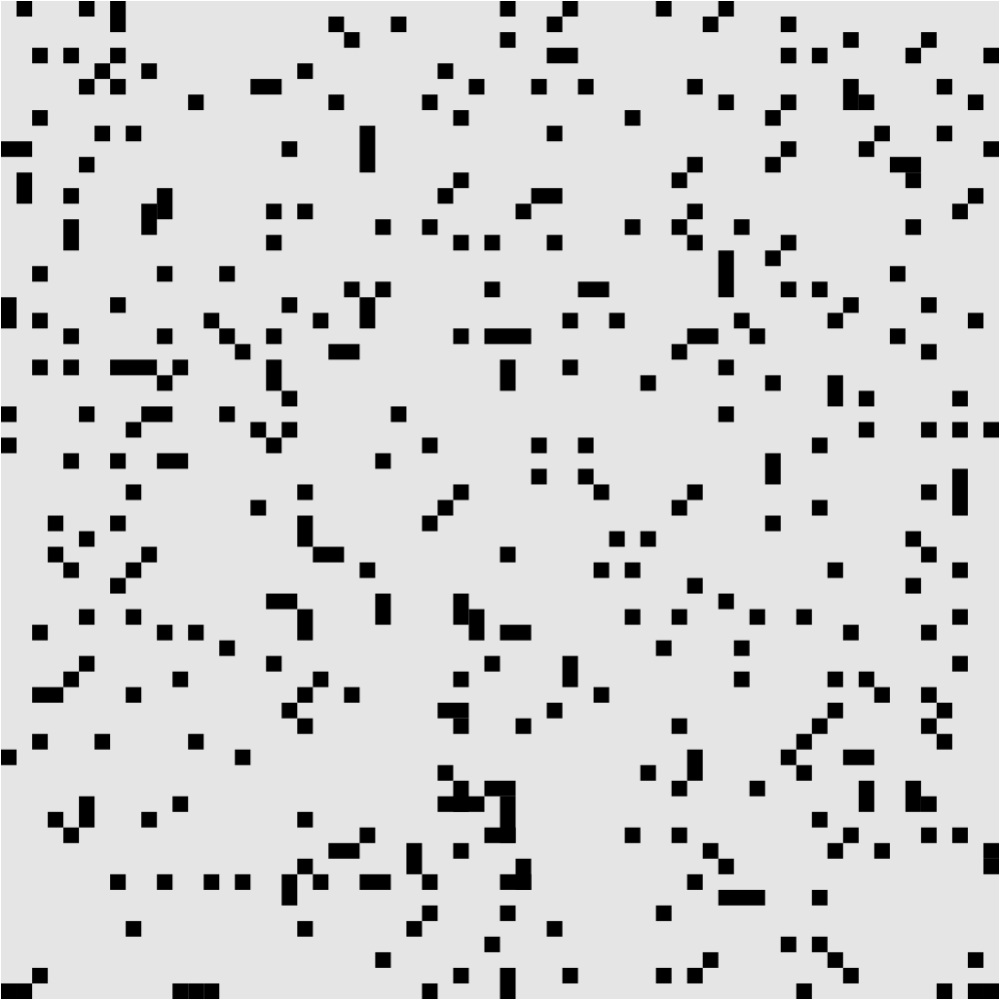
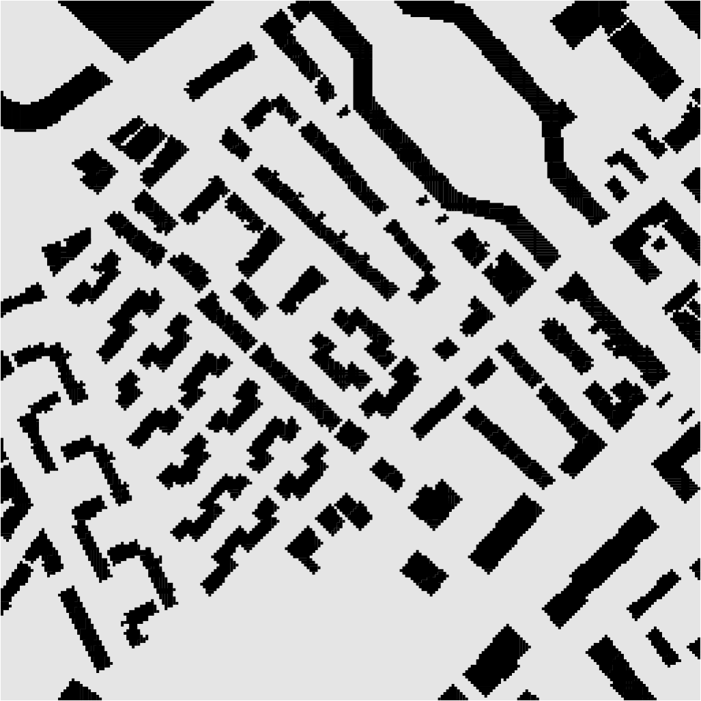
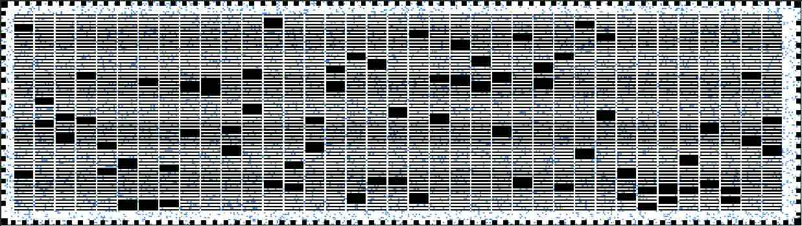
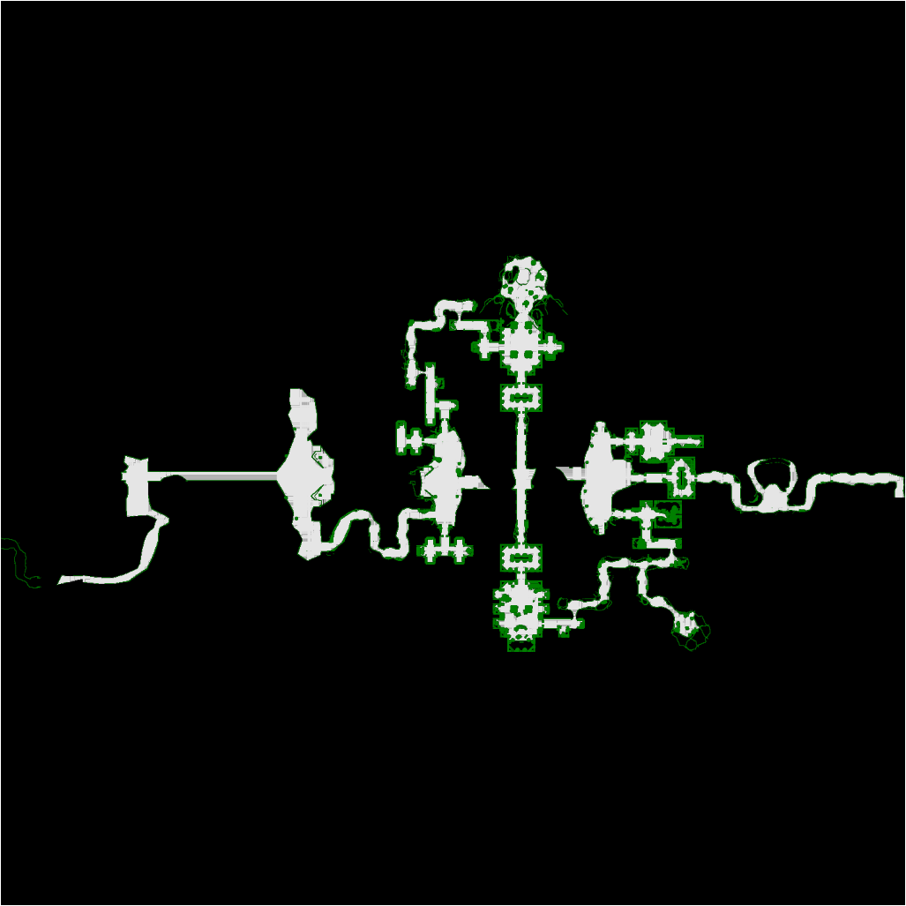
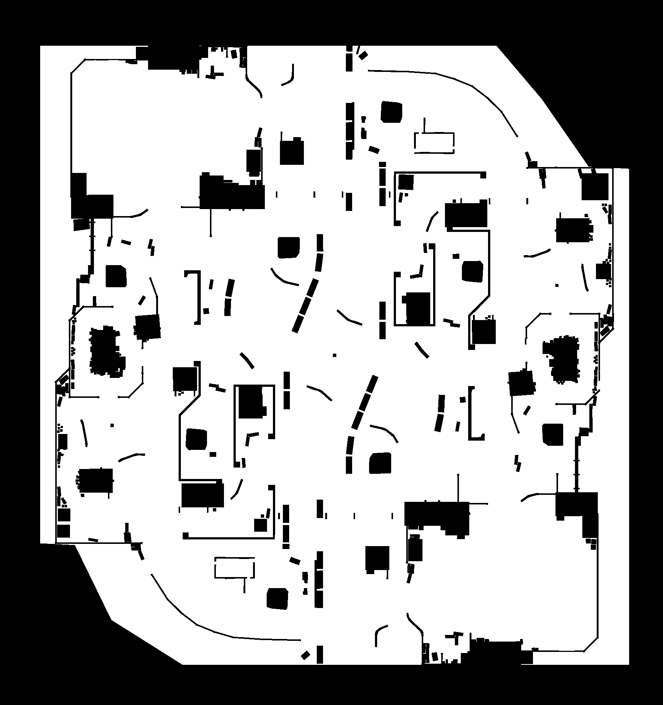

## Evaluation Process 

Submissions will be evaluated using an AWS cloud compute instance with the following specifications:

> - AMD EPYC 7R13 Processor with 32 vCPUs
> - 128 GiB Memory
> - Nvidia A10G GPU

The evaluation server deploys participant code into a docker environment, which is built based on a selected Docker image. It provides necessary
software and drivers for GPU- and CPU-based compute. 
The following Docker image options are available:
> 
> **PyTorch Docker Images**:
> - [pytorch/pytorch:2.5.1-cuda11.8-cudnn9-devel](https://hub.docker.com/layers/pytorch/pytorch/2.5.1-cuda11.8-cudnn9-devel/images/sha256-676c7b7423d7e726b814b98cfd5b702e1b32016b2e0ef0270f6202a6c660c419), Ubuntu 22.04 with PyTorch 2.5.1, CUDA 11.8, and cuDNN 9.
> - [pytorch/pytorch:2.5.1-cuda12.1-cudnn9-devel](https://hub.docker.com/layers/pytorch/pytorch/2.5.1-cuda12.1-cudnn9-devel/images/sha256-e8e63dd7baca894ba11fe1ba48a52a550793c8974f89b533d697784dd20a4dc0), Ubuntu 22.04 with PyTorch 2.5.1, CUDA 12.1, and cuDNN 9.
> - [pytorch/pytorch:2.5.1-cuda12.4-cudnn9-devel](https://hub.docker.com/layers/pytorch/pytorch/2.5.1-cuda12.4-cudnn9-devel/images/sha256-14611869895df612b7b07227d5925f30ec3cd6673bad58ce3d84ed107950e014), Ubuntu 22.04 with PyTorch 2.5.1, CUDA 12.4, and cuDNN 9.
> 
> **NVIDIA CUDA Docker Images**:
> - [nvidia/cuda:12.6.3-cudnn-devel-ubuntu20.04](https://hub.docker.com/layers/nvidia/cuda/12.6.3-cudnn-devel-ubuntu20.04/images/sha256-41b64c7236c0ff59f11298584676b4af95c0ddf9924f18c6072b160fddd6c34f), Ubuntu 20.04 with CUDA 12.6.3 and cuDNN 9.
> - [nvidia/cuda:12.6.3-cudnn-devel-ubuntu22.04](https://hub.docker.com/layers/nvidia/cuda/12.6.3-cudnn-devel-ubuntu22.04/images/sha256-cb239b67719dfa32ec6b525b54c1b78559bebd51a47249dd702f6c5429372154), Ubuntu 22.04 with CUDA 12.6.3 and cuDNN 9.
> 
> **TensorFlow Docker Images**:
> - [tensorflow/tensorflow:2.18.0-gpu](https://hub.docker.com/layers/tensorflow/tensorflow/2.18.0-gpu/images/sha256-1f16fbd9be8bb84891de12533e332bbd500511caeb5cf4db501dbe39d422f9c7), Ubuntu 22.04 with TensorFlow 2.18.0 and CUDA 12.3.
> 
> **Ubuntu Docker Images**:
> - [ubuntu:jammy](https://hub.docker.com/layers/library/ubuntu/jammy/images/sha256-3d1556a8a18cf5307b121e0a98e93f1ddf1f3f8e092f1fddfd941254785b95d7), Ubuntu 22.04.
> - [ubuntu:focal](https://hub.docker.com/layers/library/ubuntu/jammy/images/sha256-3d1556a8a18cf5307b121e0a98e93f1ddf1f3f8e092f1fddfd941254785b95d7), Ubuntu 20.04.

`pytorch/pytorch:2.5.1-cuda11.8-cudnn9-devel` is used as the default image. If you need a different image, please specify it in your submission.

Submissions will be evaluated on a range of distinct grid-map domains. Each
problem instance on each map features a different number of agents and a
different number of tasks. The maps are [available for
download](https://github.com/MAPF-Competition/Start-Kit/tree/main/example_problems)
and analysis . The problem instances (used in the main round) are hidden until
after the competition.

The evaluation process has two stages: offline preprocessing, where participants
can load and prepare auxiliary data, and online planning, where participants
try to complete as many tasks as possible, up to a fixed time limit.

Prizes are available for distinguished performance in three distinct tracks. 

## Domains

The evaluation benchmark consists of **12 instances** across **7 maps** spanning diverse domains: mazes, rooms, random grids, warehouses, and large-scale game maps.

> #### Small Pathological Problems
> |   |   |   |
> |:---:|:---:|:---:|
> | 

 | 

 | 

 |
> | `Maze (maze-32-32-2)` | `Rooms (room-64-64-16)` | `Random (random-64-64-10)` |
> | 32 × 32 narrow-corridor maze. | 64 × 64 map with 16 rooms and doorways. | 64 × 64 map with 10% random obstacles. |

> #### Large Industrial Problems
> |   |   |
> |:---:|:---:|
> | 

 | 

 |
> | `City (Boston_0_256)` | `Fulfillment` |
> | 256 × 256 city road network. | 140 × 500 warehouse layout. |

> #### Extra-large Challenge Problems
> |   |   |
> |:---:|:---:|
> | 

 | 

 |
> | `Game (orz900d)` | `Iron Harvest` |
> | 1491 × 656 game terrain. | 1800 × 1912 game terrain. |

## Benchmark Configuration Ranges

Each instance is configured with a unique combination of parameters drawn from the ranges below.

| Parameter | Range | Description |
|-----------|-------|-------------|
| **Team size** | 50 – 10,000 | Number of agents on the map |
| **Max counter** | 3 – 10 | Number of time ticks per action (controls execution speed) |
| **Delay magnitude** | 1 – 200 ticks | Per-event delay duration range; each instance specifies a [low, high] sub-range |
| **Delay duration distribution**| Uniform or Gaussian  | How dealys durations are sampled with delay manitude ranges.|
| **Delay probability** | 0.0005 – 0.02 | Probability of a delay event per agent per tick |
| **Delay event distribution**| Bernoulli or Poisson | How dealys event are sampled with delay probability.|
| **Simulation length** | 3,000 – 60,000 ticks | Total simulation ticks per instance |
| **Min communication time** | 250 – 5,000 ms | Minimum wall-clock time between planner invocations |
| **Errands per task** | 2 – 5 | Number of sequential locations per task |
| **Task distribution** | Random or Distance-based | How tasks are sampled from the map |

## Offline Preprocessing

During the preprocessing stage, the current map is revealed. You then have an opportunity to analyse the map and compute auxiliary data before proceeding to the evaluation stage (e.g., initialise data structures, load models, etc). Preprocessing time is limited to 30 minutes per map. Nothing you do at this stage will be counted into your final score.

## Online Planning

After preprocessing, your submission is evaluated on a set of (a priori
unknown) tasks. The starting locations of the robots and an initial set of
tasks are revealed. As robots complete tasks, more will be revealed. 

During evaluation, time progresses at a rate of 100 ms per timestick. Your
submission will be evaluated for up to several throusands seconds on each map. Your job is to
complete as many tasks as possible, before a time limit is reached. 

There are three evaluation tracks:
- **Execution**
- **Task Scheduling**
- **Combined**

### Task Scheduling

In this track, participants are responsible for assigning revealed tasks to
robots. At each planning update, your scheduler must return a valid task
assignment (including no assignment) for every robot. The schedule is then
realised by the default planner and default executor in the start-kit.

Your scheduler must compute valid assignments for revealed, unallocated tasks.
Time continues to elapse while scheduling deliberates, so efficient assignment
is critical for strong performance.

### Execution Track
In the Execution Track, participants implement the executor component. The
default scheduler and default planner provide schedule and multi-step planner
actions, while your executor processes new plans into staged actions and issues
per-tick `GO`/`STOP` execution commands.

The execution layer is evaluated on how effectively it keeps robots progressing
under timing constraints, safety checks, and possible execution delays.

### Combined Track
In the Combined Track, participants can modify scheduler, planner, and executor
together, which gives maximum flexibility over assignment, planning, and
execution behavior.

### Scoring and the Virtual Best

Performance in each track is determined relative to a **virtual best**
baseline. The virtual best comprises all best known solutions for every
evaluation instance, as computed by any submission. For a given submission, 
the score is computed using the following formula:

>
> $$\mbox{Submission score} = \displaystyle \sum^{max}_{i=0}{\frac{\mbox{Your number of tasks finished for instance }i}{\mbox{best number of tasks finished for instance }i}}$$

 

## Track Prizes

Each track has a separate
leaderboard. Participants submitting to the Combined track compete for the
grand prize. Other participants (i.e., Execution only or Task Scheduling only)
compete for track prizes.

Single-track solutions are further ranked and evaluated on the Combined
leaderboard (i.e. everyone is eligible for the grand prize). 
A separate prize, also available to participants in any track, is **Line Honours**. This prize is
awarded to the team which contributes the largest number of solutions to the
virtual best solver. 

In addition to the three tracks, we keep track of who contributed the largest number of solutions to the virtual best. The submission with largest number of best solutions at the end of the competition is declared as the winner of the Line Honours prize. 

