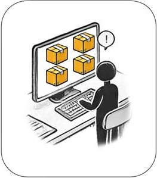
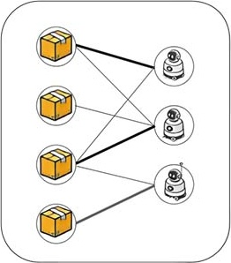
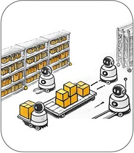

## Introduction 

The League of Robot Runners, sponsored by Amazon Robotics, is a **competition** series where participants tackle the **core combinatorial challenges** found in cooperative multi-robot coordination problems: **robot dynamics 🤖**, **lifelong planning ♻️**, **task assignment 🎯** and **real-time execution ⏳**. Besides being intellectually stipulating, these challenges present themselves in high-impact industrial applications including warehouse logistics, transportation, and advanced manufacturing. 

<!--  -->

  

 
## How It Works 
<!-- What we ask you to do, what you get if you do well, what are the important dates -->
<!--  -->

<!-- 
🚀 Participants develop novel algorithms to assign tasks to a team of robots and then coordinate the robots to complete the assigned tasks as quickly as possible, collision-free.🚀 
-->
🚀
Participants in the League (that's you!) control a team of robotic errand
runners. The robots operate in a simple grid environment, working together to
complete tasks. Their job is to finish as many tasks as possible, as quickly as
possible, until time runs out. Your job (choose one, or both) is **Planning**
and **Scheduling**. Planning means you decide how the robots move: compute
paths and avoid collisions so the robots can complete their assigned tasks.
Scheduling means you decide the assignments: which robot completes which task
and when. 
🚀

 
New tasks constantly arrive! 

 
Which robot should complete which task? It's your call!

 
Which route to take? Find efficient paths and avoid collisions!

Participating in the competition is a great way to showcase your skills:
compete for fame, glory and cash prizes against the best in the world!  You can
also make a tangible impact in the research community: by contributing to the
establishment of new benchmarks and the creation of new algorithmic baselines.
Moreover, your involvement will help increase attention to this critical
problem and contribute to the growth of our community.

🛠️ **Low barriers:** the competition provides starter code, supporting tools and documentation, to help you quickly develop and validate your solutions. 

📈 **Continuous feedback:** track your progress against the best in the world on our live leaderboard. 

📂 **Open source: submissions:**, top submissions, best solutions and all problem instances will be open-sourced, after the competition ends, which allows others to buld on your success and make further advancements.
  
  
<!-- 
> The competition recognises distinguished performance in three categories:
> - **🏇🏼 Path Planning Track**: We provide a scheduler, assigning tasks to robots. You need to plan their paths. 
>
> - **📋 Task Scheduling Track**: You assign tasks to robots. We provide a planner to compute their paths.
> 
> - **🏁 Combined Track**: Schedule the tasks **and** Plan the paths. Complete control for maximal efficiency!
-->

## Eligibility and Prizes 

Participation is open to individuals and teams from any discipline/background, anywhere in the world. Financial prizes (in USD) are available for **top performance** in three distinct tracks🏆:

> - **💸 $2,500** prizes in the **Path Planning Track**. 
> 
> - **💸 $2,500** prizes in the **Task Scheduling Track**
>
> - **💰 $5,000** prizes in the **Combined Track**

There will also be a **💵 $500** Line Honours prize, for the team that
contributes the most solutions to the virtual best. Other notable performances
(2nd, 3rd place in each category) will be recognised with a certificate. Find
our more about the tracks and how they work on our [problem setup](./problem)
and [evaluation](./evaluation) pages. 

 

## Timeline 
 

> - **Jun - Sep**: Details and more news
> - **Oct**: Start-kit release, test round
> - **Oct - Jan**: Competition period

 

---

|     |     |     |     |     |     |     |
|:---:|:---:|:---:|:---:|:---:|:---:|:---:|
| |  |  |  |  |   | |
