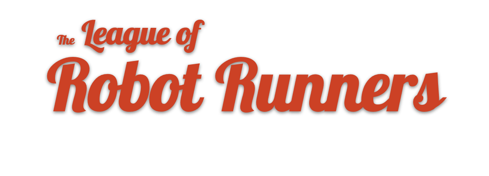

<!-- ## Introduction 
 -->

<!--  -->
**The League of Robot Runners is a competition series that tackles one of the most challenging problems in automated logistics: coordinating a team of moving robots.**

Such problems often appear in the research literature, where they are modelled and solved using a variety of simplifying assumptions. The League of Robot Runners aims to bridge the gap, between academia and industry, by identifying the core combinatorial challenges that make robot coordination problems difficult to solve, in practice.

The first round of this competition was held in 2023, and we focus on path planning with **robot turnings, lifelong problem and online planning**. We received a total of 825 submissions from 25 teams worldwide, which is a big success! 

Now the **2024 League of Robot Runners** is coming, and we have exciting new tracks with path planning and task assignments for you to showcase your skills! Find out more about the upcoming round in our website!

<h2>2024 Competition Timeline</h2>

- June: Details and more news
- July:  Start-kit release
- Aug - Dec: Competition period

---

|     |     |     |     |     |     |     |
|:---:|:---:|:---:|:---:|:---:|:---:|:---:|
| |  |  |  |  |   | |
