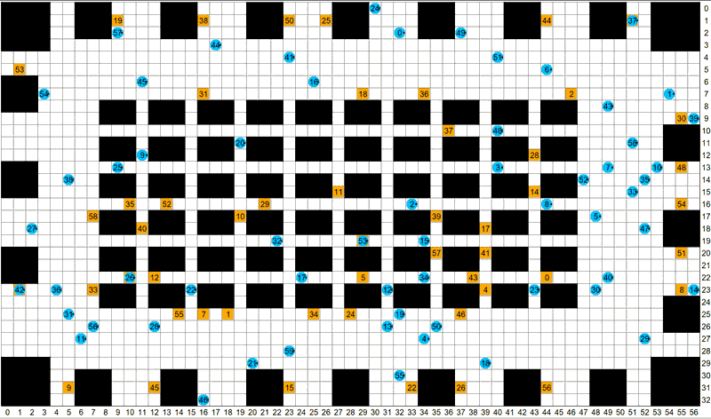

## Introduction 

The League of Robot Runners, sponsored by Amazon Robotics, is a competition where participants tackle one of the most complex optimization challenges: the coordination of multiple moving robots, which is important for industrial applications such as warehouse logistics, transportation and advanced manufacturing.

## The Mission 

**Your mission, should you choose to accept it, is to navigate a team of robotic errand runners, completing tasks as efficiently as possible, while subject to computational constraints.**

Simplified versions of such problems appear in the research literature under the name Multi-Agent Path Finding, Multi-Robot Path Planning and many others besides. In this competition we bridge the gap between academia and industry by identifying the core combinatorial challenges that make these problems difficult to solve in practice.

Participating in the competition means not only demonstrating your skills against the best in the field but also contributing to the establishment of new benchmarks and algorithmic baselines. You'll have the chance to make a tangible impact on the progression of the research field, with the possibility of your innovative solutions being adopted by the wider community. Moreover, your involvement will help increase attention to this critical problem and contribute to the growth of our community. 

The first round of this competition was held in 2023, and we focus on path planning with **robot turnings, lifelong problem and online planning**. We received a total of **825 submissions** from **25 teams worldwide**, which is a big success! 

## 2024 Competition 
Now the **2024 League of Robot Runners** is coming, and we have exciting new tracks with path planning and task assignments for you to showcase your skills! Find out more about the upcoming round in our website!

**Timeline**
> - **June**: Details and more news
> - **July**:  Start-kit release
> - **Aug - Dec**: Competition period

---

|     |     |     |     |     |     |     |
|:---:|:---:|:---:|:---:|:---:|:---:|:---:|
| |  |  |  |  |   | |
