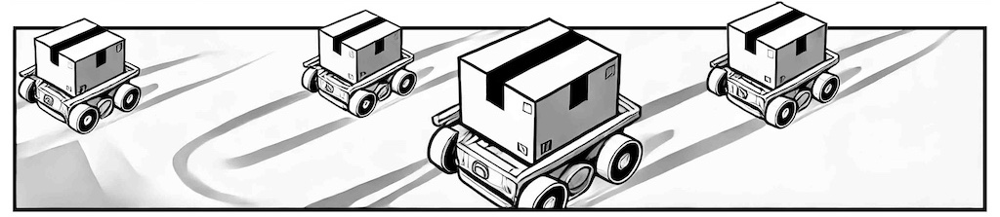
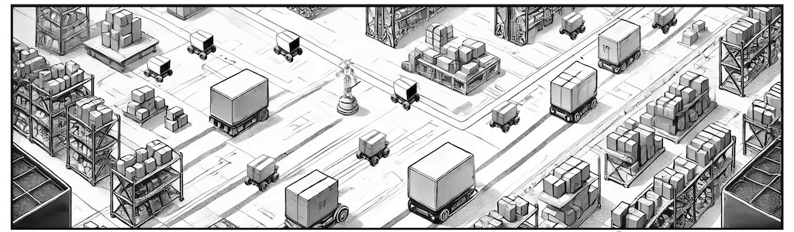
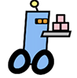
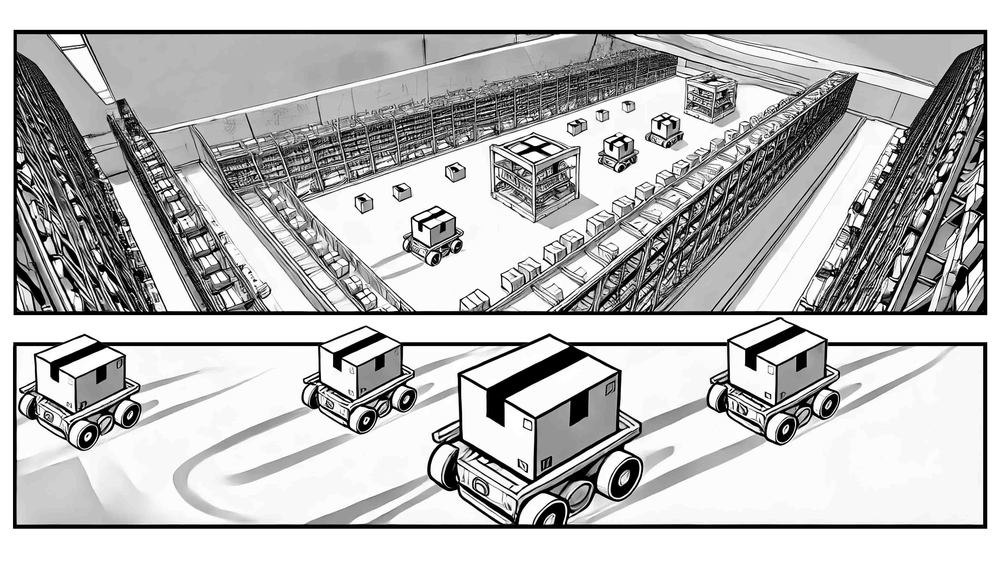
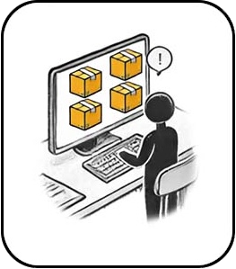
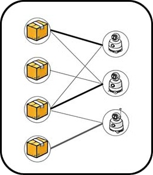
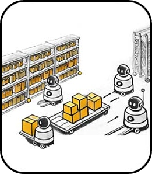
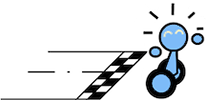
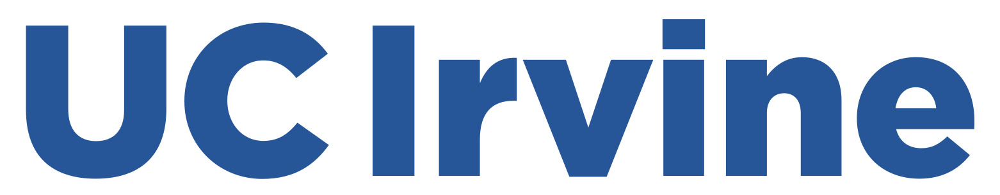

## Introduction 

The League of Robot Runners, sponsored by Amazon Robotics, is a **competition** series where participants tackle the **core combinatorial challenges** found in cooperative multi-robot coordination problems: **robot dynamics 🤖**, **lifelong planning ♻️**, **task assignment 🎯** and **real-time execution ⏳**. Besides being intellectually stimulating, these challenges present themselves in high-impact industrial applications including warehouse logistics, transportation, and advanced manufacturing. 

<!--  -->

  

## How It Works 
<!-- What we ask you to do, what you get if you do well, what are the important dates -->
<!--  -->

<!-- 
🚀 Participants develop novel algorithms to assign tasks to a team of robots and then coordinate the robots to complete the assigned tasks as quickly as possible, collision-free.🚀 
-->

Participants in the League (that's you!) control a team of robotic errand
runners. The robots operate in a simple **grid environment**, working together to
complete tasks. Their job is to finish as many tasks as possible, as quickly as
possible, until time runs out. Your job (choose one, or both) is **Planning**
and **Scheduling**. Planning means you decide how the robots move: compute
paths and avoid collisions so the robots can complete their assigned tasks.
Scheduling means you decide the assignments: which robot completes which task
and when. 

 

 
In a busy warehouse, 
new tasks constantly arrive. 

 
Which robot should complete which task? It's your call!

 
Which route to take? Find a collision-free path!

 

<!-- Interested? Here are three more reasons to join: -->

The competition is a great way to showcase your skills
against the best in the world; **fame, glory and prizes** are all up for grabs!
You can also make a tangible impact in the **research community**, by contributing to the
establishment of new benchmarks and the creation of new algorithmic baselines.
<!-- Plus, you be helping raise awareness about an important problem
area and help foster the growth of the community.  -->

🛠️ **Low barriers:** the competition provides starter code, supporting tools
and documentation, to help you quickly develop and validate your solutions. 

📈 **Continuous feedback:** submit anytime and track your progress on our live leaderboard. 

📂 **Open source:** top submissions, best solutions and all
problem instances will be open-sourced after the competition ends. 
This allows others to build on your success and make further advancements.
  

Our robots need you! [Sign up](./submission) today! 🚀

  
<!-- 
> The competition recognises distinguished performance in three categories:
> - **🏇🏼 Path Planning Track**: We provide a scheduler, assigning tasks to robots. You need to plan their paths. 
>
> - **📋 Task Scheduling Track**: You assign tasks to robots. We provide a planner to compute their paths.
> 
> - **🏁 Combined Track**: Schedule the tasks **and** Plan the paths. Complete control for maximal efficiency!
-->

## Eligibility and Prizes 

Participation is open to individuals and teams from any discipline/background, anywhere in the world. Financial prizes (in USD) are available for **top performance** in three distinct tracks🏆:

> **Path Planning Track:** 
> -  We provide a scheduler, assigning tasks to robots. You need to plan their paths. 
> - 💸 $2,500 First Place Prize 💸 
> 
> **Task Scheduling Track:** 
> - You assign tasks to robots. We provide a planner to compute their paths.
> - 💸 $2,500 First Place Prize 💸 
>
> **Combined Track:** 
> - You assign the tasks **and** plan the paths. Complete control for maximal efficiency!
> - 💰 $5,000 <u>Grand Prize</u> 💰

There will also be a 💵 $1,000 **Line Honours** prize, for the team that
computes the largest number of best-known solutions, at the end of the
competition. Other notable performances (2nd, 3rd place in each track) will be
recognised with a certificate. 

Find our more about the tracks and how they work on our [problem
setup](./problem) and [evaluation](./evaluation) pages. 

## Timeline 
 

All dates are AOE (UTC-12). In other words, if there is still time Anywhere on Earth, the
deadline has not yet passed.

> - **20th May 2024**: Competition announcement
> - **4th October 2024**: Start kit release, open for testing
> - **15th November 2024**: Main round begins (~~1st November 2024~~)
> - **16th February 2025**: Main round ends
> - **2nd March 2025**: Winner annoucement
> - **May 2025**: Robot Runners Virtual Expo 

 

---

|     |     |     |     |     |     |     |     |
|:---:|:---:|:---:|:---:|:---:|:---:|:---:|:---:|
| |  |  |  |  |  |   | |

<link fetchpriority='high' rel="stylesheet" href="./external_page_resource/style.css" type="text/css">
