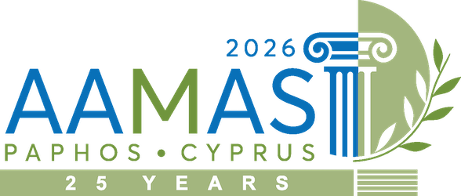
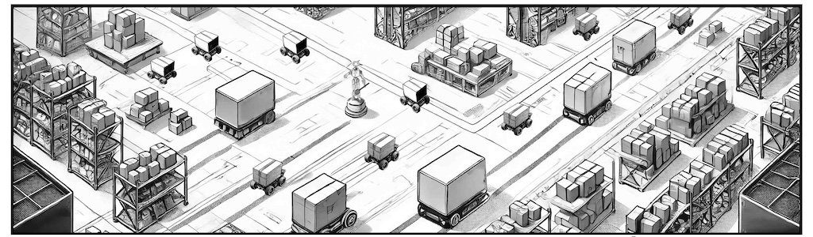
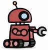
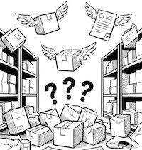
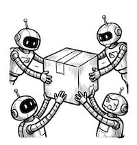
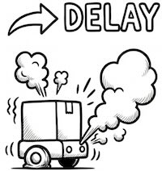
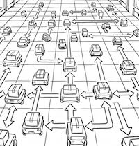

## Introduction 

The League of Robot Runners, sponsored by Amazon Robotics, is a _competition series_ where participants tackle the core combinatorial challenges found in cooperative multi-robot coordination problems.

For the 2026 season, we are raising the bar. In addition to **task assignment 🎯** and **lifelong planning ♻️**, we are introducing **stochasticity** and **uncertainty management 🎲**. These challenges mirror high-impact industrial applications—such as warehouse logistics and advanced manufacturing—where robots must adapt to real-world imperfections and delays in real-time.

<!-- 

<strong>🎉 Co-hosted with AAMAS 2026</strong>
 
The League of Robot Runners 2026 is proudly co-hosted with the <a href="https://www.aamas2025.org/" target="_blank">25th International Conference on Autonomous Agents and Multiagent Systems (AAMAS 2026)</a>.
 

 -->

> <strong>🎉 Co-hosted with AAMAS 2026</strong>
> The League of Robot Runners 2026 is proudly co-hosted with the <a href="https://www.aamas2025.org/" target="_blank">25th International Conference on Autonomous Agents and Multiagent Systems (AAMAS 2026)</a>. 
> 

<!--  -->

## How It Works 

Participants in the League (that's you!) control a team of robotic errand runners operating in a grid environment. Their job is to finish as many tasks as possible, as quickly as possible. Your job (depending on the track) involves **Task Scheduling**, **Execution Control**, and **Path Planning**:

 

 
Tasks (orders) are continuously coming to a busy warehouse.

 
Decide which robot should complete which task? It's your call!

 
Delays may happen! Your policy must handle interruptions.

 
Plan collision-free paths for a massive robot fleet to fulfill tasks.

 

In 2026, we introduce **Delay Probabilities** ⚠️. Robots may not always execute their move on time due to simulated mechanical or communication delays. Your goal is not just to find a path, but to create a robust **Execution Policy** that keeps the fleet moving smoothly even when individual robots fall behind.

The competition is a great way to showcase your skills against the best in the world; **fame, glory and prizes** are all up for grabs! You can also make a tangible impact in the **research community** by establishing baselines for robust Multi-Agent Path Finding (MAPF) under uncertainty.

🛠️ **Low barriers:** We provide starter code, supporting tools, and documentation to help you quickly develop and validate your solutions.

📈 **Continuous feedback:** Submit anytime and track your progress on our live leaderboard.

📂 **Open source:** Top submissions and problem instances will be open-sourced after the competition ends.

## Eligibility and Prizes 

Participation is open to individuals and teams from any discipline/background, anywhere in the world. Financial prizes (in USD) are available for **top performance** in three distinct tracks🏆:

> **Execution Track:**
> - We provide the task scheduler and path planner.
> - You create an **Execution Policy** that handle delays.
> - 💸 Cash Prizes Available (Amount TBA) 💸
>
> **Task Scheduling Track:**
> - You assign tasks to robots. We provide path planner and execution policy.
> - Your schedule must account for the uncertainty of the execution phase.
> - 💸 Cash Prizes Available (Amount TBA) 💸
>
> **Combined Track:**
> - You assign the tasks, plan paths, **and** control the execution.
> - Complete control for maximal efficiency in a stochastic environment!
> - 💰 **Grand Prize** (Amount TBA) 💰

There will also be a **Line Honours** prize for the team that computes the largest number of best-known solutions. Other notable performances will be recognized with certificates.

<!-- Find our more about the tracks and how they work on our [problem setup](./problem) and [evaluation](./evaluation) pages. -->

## Timeline 
 

<!-- All dates are AOE (UTC-12). -->

> - **December 2025**: Competition announcement
> - **Mid-February 2026**: Start kit release, open for testing
> - **Mid-March 2026**: Main round begins
> - **Early May 2026**: Main round ends
> - **AAMAS 2026**: Winner announcement & Results (co-hosted event)

 

---

Co-hosted with AAMAS 2026 | Sponsored by Amazon Robotics | Organised by leading research institutions

|     |     |     |     |     |     |     |     |
|:---:|:---:|:---:|:---:|:---:|:---:|:---:|:---:|
| |  |  |  | |  |  |  |

<link fetchpriority='high' rel="stylesheet" href="./external_page_resource/style.css" type="text/css">