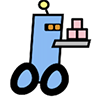
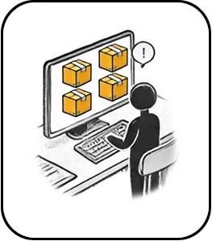
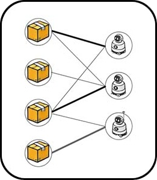
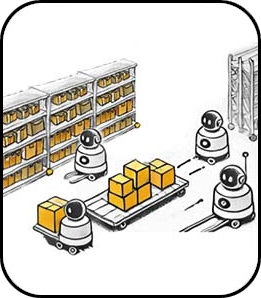

## Introduction 

The League of Robot Runners, sponsored by Amazon Robotics, is a **competition** series where participants tackle the **core combinatorial challenges** found in cooperative multi-robot coordination problems. 

For the 2026 season, we are raising the bar. In addition to **task assignment 🎯** and **lifelong planning ♻️**, we are introducing **uncertainties** and **execution policies**. These challenges mirror high-impact industrial applications—such as warehouse logistics and advanced manufacturing—where robots must adapt to real-world imperfections and delays in real-time.

  
## How It Works 

Participants in the League (that's you!) control a team of robotic errand runners operating in a grid environment. Their job is to finish as many tasks as possible, as quickly as possible.

**New for 2026: Delay Probabilities** ⚠️
In the past, robots moved perfectly. In 2026, we introduce **Delay Probabilities**. Robots may not always execute their move on time due to simulated mechanical or communication delays. Your goal is not just to find a path, but to create a robust **Execution Policy** that keeps the fleet moving smoothly even when individual robots fall behind.

Your job (depending on the track) involves **Execution Control** and **Scheduling**:
1.  **Execution:** You develop a policy to handle robot movements and mitigate collisions when delays occur.
2.  **Scheduling:** You decide the assignments—which robot completes which task and when, accounting for potential execution lag.

The competition is a great way to showcase your skills against the best in the world; **fame, glory and prizes** are all up for grabs! You can also make a tangible impact in the **research community** by establishing baselines for robust Multi-Agent Path Finding (MAPF) under uncertainty.

🛠️ **Low barriers:** We provide starter code, supporting tools, and documentation to help you quickly develop and validate your solutions. 

📈 **Continuous feedback:** Submit anytime and track your progress on our live leaderboard. 

📂 **Open source:** Top submissions and problem instances will be open-sourced after the competition ends.

Our robots need you! [Sign up](./submission) today! 🚀

## Eligibility and Prizes 

Participation is open to individuals and teams from any discipline/background, anywhere in the world. Financial prizes (in USD) are available for **top performance** in three distinct tracks🏆:

> **Execution Track:** > - We provide the tasks and a scheduler. 
> - You create an **Execution Policy** to move robots and handle delay probabilities without deadlocking.
> - 💸 Cash Prizes Available (Amount TBA) 💸 
> 
> **Task Scheduling Track:** > - You assign tasks to robots. We provide a planner/execution policy.
> - Your schedule must account for the uncertainty of the execution phase.
> - 💸 Cash Prizes Available (Amount TBA) 💸 
>
> **Combined Track:** > - You assign the tasks **and** control the execution. 
> - Complete control for maximal efficiency in a stochastic environment!
> - 💰 **Grand Prize** (Amount TBA) 💰

There will also be a **Line Honours** prize for the team that computes the largest number of best-known solutions. Other notable performances will be recognized with certificates.

Find our more about the tracks and how they work on our [problem setup](./problem) and [evaluation](./evaluation) pages. 

## Timeline 
 

All dates are AOE (UTC-12). *Dates below are tentative for the 2026 season.*

> - **TBA 2026**: Competition announcement
> - **TBA 2026**: Start kit release, open for testing
> - **TBA 2026**: Main round begins
> - **TBA 2027**: Main round ends
> - **TBA 2027**: Winner announcement

 

---

|     |     |     |     |     |     |     |     |
|:---:|:---:|:---:|:---:|:---:|:---:|:---:|:---:|
| |  |  |  |  |  |   | |

<link fetchpriority='high' rel="stylesheet" href="./external_page_resource/style.css" type="text/css">

<!-- ## Introduction 

The League of Robot Runners, sponsored by Amazon Robotics, is a **competition** series where participants tackle the **core combinatorial challenges** found in cooperative multi-robot coordination problems: **robot dynamics 🤖**, **lifelong planning ♻️**, **task assignment 🎯** and **real-time execution ⏳**. Besides being intellectually stimulating, these challenges present themselves in high-impact industrial applications including warehouse logistics, transportation, and advanced manufacturing. 

  

## How It Works 

Participants in the League (that's you!) control a team of robotic errand
runners. The robots operate in a simple **grid environment**, working together to
complete tasks. Their job is to finish as many tasks as possible, as quickly as
possible, until time runs out. Your job (choose one, or both) is **Planning**
and **Scheduling**. Planning means you decide how the robots move: compute
paths and avoid collisions so the robots can complete their assigned tasks.
Scheduling means you decide the assignments: which robot completes which task
and when. 

 

 
In a busy warehouse, 
new tasks constantly arrive. 

 
Which robot should complete which task? It's your call!

 
Which route to take? Find a collision-free path!

 

<!-- Interested? Here are three more reasons to join: -->

The competition is a great way to showcase your skills
against the best in the world; **fame, glory and prizes** are all up for grabs!
You can also make a tangible impact in the **research community**, by contributing to the
establishment of new benchmarks and the creation of new algorithmic baselines.
<!-- Plus, you be helping raise awareness about an important problem
area and help foster the growth of the community.  -->

🛠️ **Low barriers:** the competition provides starter code, supporting tools
and documentation, to help you quickly develop and validate your solutions. 

📈 **Continuous feedback:** submit anytime and track your progress on our live leaderboard. 

📂 **Open source:** top submissions, best solutions and all
problem instances will be open-sourced after the competition ends. 
This allows others to build on your success and make further advancements.
  

Our robots need you! [Sign up](./submission) today! 🚀

## Eligibility and Prizes 

Participation is open to individuals and teams from any discipline/background, anywhere in the world. Financial prizes (in USD) are available for **top performance** in three distinct tracks🏆:

> **Path Planning Track:** 
> -  We provide a scheduler, assigning tasks to robots. You need to plan their paths. 
> - 💸 $2,500 First Place Prize 💸 
> 
> **Task Scheduling Track:** 
> - You assign tasks to robots. We provide a planner to compute their paths.
> - 💸 $2,500 First Place Prize 💸 
>
> **Combined Track:** 
> - You assign the tasks **and** plan the paths. Complete control for maximal efficiency!
> - 💰 $5,000 <u>Grand Prize</u> 💰

There will also be a 💵 $1,000 **Line Honours** prize, for the team that
computes the largest number of best-known solutions, at the end of the
competition. Other notable performances (2nd, 3rd place in each track) will be
recognised with a certificate. 

Find our more about the tracks and how they work on our [problem
setup](./problem) and [evaluation](./evaluation) pages. 

## Timeline 
 

All dates are AOE (UTC-12). In other words, if there is still time Anywhere on Earth, the
deadline has not yet passed.

> - **20th May 2024**: Competition announcement
> - **4th October 2024**: Start kit release, open for testing
> - **15th November 2024**: Main round begins (~~1st November 2024~~)
> - **16th February 2025**: Main round ends
> - **2nd March 2025**: Winner annoucement
> - **May 2025**: Robot Runners Virtual Expo 

 

---

|     |     |     |     |     |     |     |     |
|:---:|:---:|:---:|:---:|:---:|:---:|:---:|:---:|
| |  |  |  |  |  |   | |

<link fetchpriority='high' rel="stylesheet" href="./external_page_resource/style.css" type="text/css"> -->
