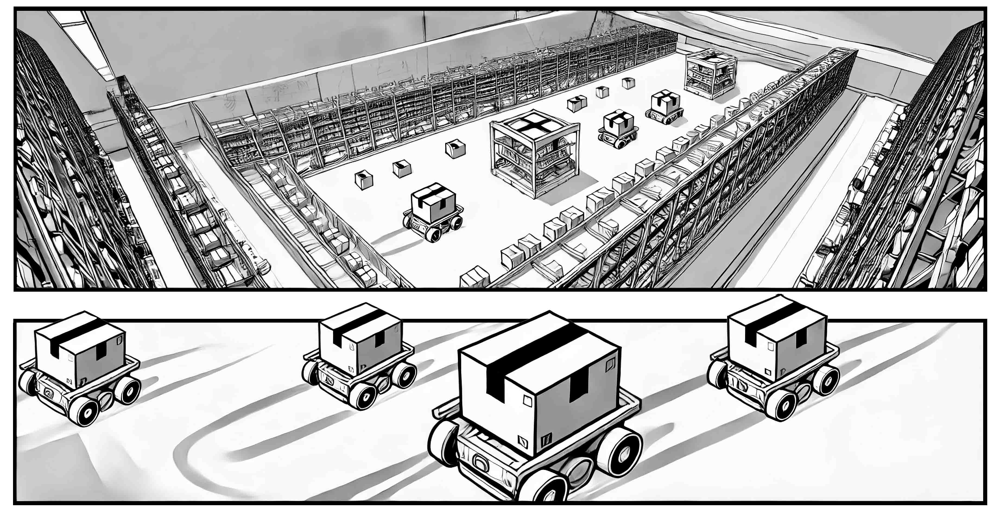

## Introduction 

The League of Robot Runners, sponsored by Amazon Robotics, is a **competition** series where participants tackle the **core combinatorial challenges** found in cooperative multi-robot coordination problems: **agent dynamic 🤖**, **lifelong planning ♻️**, **real-time execution ⏳**, and **task assignment 🎯**. These challenges are important for industrial applications such as warehouse logistics, transportation and advanced manufacturing. 

<h3>Coordinate thousands of robots in a busy warehouse!</h3>

|  |    |   |
|:---:|:---:|:---:|
|     |     |     |
| Continuously arriving customer orders! | Dynamically decide who for which task! |  Lifelong collision-free path planning for each robot! |

## The Mission 
<!-- What we ask you to do, what you get if you do well, what are the important dates -->
<!--  -->

🚀 Participants are asked to develop algorithms that assign tasks to a team of robots and coordinate robots to complete assigned tasks in a given environment. The competition recognises distinguished performance in three distinct categories:

<!-- |  |    |   |
|---|---|---|
|   |   |   | -->

> - **🏇🏼 Path Planning Track**: Participants develop algorithms that coordinate a team of robots to complete assigned tasks, given a default task scheduler.
> - **📋 Task Scheduling Track**: Participants develop algorithms that schedule tasks to a team of robots, given a default path planner coordinates the robots.
> - **🏁 Combined Track**: Participants develop both path planning and task scheduling algorithms.

🛠️ The competition provides a standardised system to develop, evaluate, and compare algorithmic techniques. 

📂 Submissions, solutions and problem instances from the competition will be open-sourced, to lower barriers, promote dissemination and enable further advancements.

## Eligibility and Prizes 

Participation is open to individuals and teams of individuals from any discipline and background and from any geographic location. Financial prizes (in $USD) are available for **distinguished performance** 🏆:

> - **💰 $5,000 cash prizes in the Combined Track!**
> - **💸 $2,500 cash prizes in the Path Planning Track!**
> - **💸 $2,500 cash prizes in the Task Scheduling Track!**

Other notable performances (2nd, 3rd place in each category) will be recognised with a certificate.

 

## Timeline 
 

> - **Jun - Jul**: Details and more news
> - **Jul - Aug**: Start-kit release
> - **Aug - Dec**: Competition period

 

---

|     |     |     |     |     |     |     |
|:---:|:---:|:---:|:---:|:---:|:---:|:---:|
| |  |  |  |  |   | |
