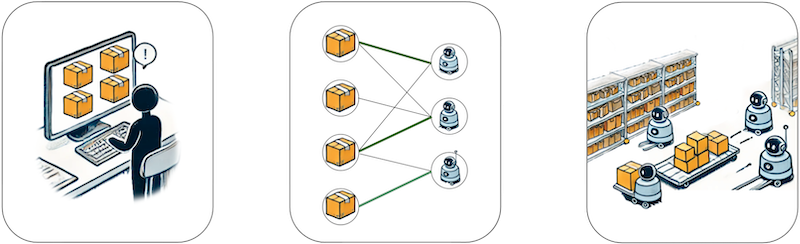

## Introduction 

The League of Robot Runners, sponsored by Amazon Robotics, is a **competition** series where participants tackle the **core combinatorial challenges** found in cooperative multi-robot coordination problems: **agent dynamic 🤖**, **lifelong planning ♻️**, **real-time execution ⏳**, and **task assignment 🎯, a newly introduced challenge for the upcoming 2024 competition**. These challenges are important for industrial applications such as warehouse logistics, transportation and advanced manufacturing. 

## The Mission 
<!-- What we ask you to do, what you get if you do well, what are the important dates -->

🚀 Participants are asked to develop algorithms that assign tasks to a team of robots and coordinate them to complete assigned tasks in a given environment. 

🛠️ The competition provides a standardised system to develop, evaluate, and compare algorithmic techniques. 

📂 Submissions, solutions and problem instances from the competition will be open-sourced, to lower barriers, promote dissemination and enable further advancements.

## Prizes 
 

> **🆠Distinguished performance awards!**  
> **💸 $10,000 in cash prizes!**

 

## Timeline 
 

> - **Jun - Jul**: Details and more news
> - **Jul - Aug**: Start-kit release
> - **Aug - Dec**: Competition period

 

---

|     |     |     |     |     |     |     |
|:---:|:---:|:---:|:---:|:---:|:---:|:---:|
| |  |  |  |  |   | |
