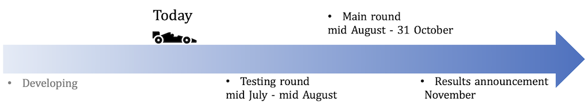

The League of Robot Runners, sponsored by Amazon Robotics, is a new competition inititive where participants tackle one of the most complex optimization challenges: the coordination of moving robots for industrial applications such as warehouse logistics, transportation and advanced manufacturing.  

**Your mission, should you choose to accept it, is to navigate a team of robotic errand runners, completing tasks as efficiently as possible, while subject to computational constraints.** 

Simplified versions of such problems appear in the research literature under the name Multi-Agent Path Finding, Multi-Robot Path Planning and many others besides. In this competition we bridge the gap between academia and industry by identifying the core combinatorial challenges that make these problems difficult to solve in practice.

Participating in the competition means not only demonstrating your skills against the best in the field but also contributing to the establishment of new benchmarks and algorithmic baselines. You'll have the chance to make a tangible impact on the progression of the research field, with the possibility of your innovative solutions being adopted by the wider community. Moreover, your involvement will help increase attention to this critical problem and contribute to the growth of our community. 

## Eligibility and prizes

Participation is open to individuals and teams of individuals from any discipline and background and from any geographic location. A limited number of **training awards** are available, to help with costs associated with the development of computational models. 

Cash prizes (in $USD) are available for distinguished performance:

- Best overall ($5,000)
- Line honours ($2,500)
- Fast mover ($2,500)

Register and submit your implementation before the submission deadline to participate!

## Important Dates

