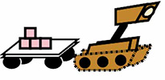

## 2023 Benchmark Archive and Code Archive 

The Benchmark Archive and the Code Archive gather all of your best submissions from the 2023 competition, with all problem instances and known best solutions. 🥁🥁🥁

These resources will help us track our progress on the core challenges associated with planning and coordinating teams of real robots. Researchers in the area (that’s you!) can use these resources to further develop and compare their algorithms against the established state-of-the-art. Meanwhile, newcomers to the area also get a leg up! They can start with working implementations and build their new ideas upon best-known solution techniques.🔥🔥🔥

💯In the [Benchmark Archive](https://github.com/MAPF-Competition/Benchmark-Archive), you will find:

* Example instances released with the start-kit.
* Main round evaluation instances.
* Test round evaluation instances.
* Best-known solutions to all evaluation instances.
* Tables that describe the configuration of each benchmark instance, metrics describing the best-known solution for that instance, links to download the solutions, and links to the implementation that produced that solution. 
* Benchmark generator to produce all the problem instances used in the 2023 competition.

All the best-known solutions can be downloaded and analysed with [PlanViz](https://github.com/MAPF-Competition/PlanViz), our offline visualisation tool (previously open-sourced in 2023).

📂In the [Code Archive](https://github.com/MAPF-Competition/Code-Archive), you will find:

* Implementations for the best submission of each team on the final leaderboard of the Fast Mover and Overall Best categories.
* Implementations that produced any best-known solution in the Line Honours category.
* Tables that record the metrics of each archived implementation.

## Plan Visualiser

[PlanViz](https://github.com/MAPF-Competition/MAPF_analysis/tree/main) is an offline visualization tool for analysing solutions to multi-robot and multi-agent coordination problems. It can be used to better understand how your robots move across the map and provide additional insights into the errors and events the competition Start-Kit gives. Although not required for the competition, we developed PlanViz to provide additional support for participants.

## More information

The community website, [mapf.info](http://mapf.info), contains various introductory material on the closely related topic of Multi-Agent Path Finding. Visit this page to find out what the topic is all about, who is working in the area, for copies and videos of presentations related to MAPF, as well as links to recent papers and baseline implementations of many successful algorithms. 

The [MAPF Tracker](http://tracker.pathfinding.ai) is a community website that contains the best-known results on many MAPF benchmarks. Visit this page for an overview of the current challenges in this area and to compare the relative strengths of different solvers in a non-competitive setting.
