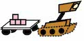

## Start Kit 

The start kit is a code harness that you must interface with when developing your submission. It is a good idea to become familiar with how it works. A good starting point is the included [instructions](https://github.com/MAPF-Competition/Start-Kit/blob/main/README.md).

Further documentation, to help you [prepare your planner](https://github.com/MAPF-Competition/Start-Kit/blob/main/Prepare_Your_Planner.md) and details about the [submission process](https://github.com/MAPF-Competition/Start-Kit/blob/main/Submission_Instruction.md) are also available.

## Test Maps and Example Problems

The [set of maps](https://github.com/MAPF-Competition/Start-Kit/tree/main/example_problems) that you will be evaluated on are revealed as part of the competition. You can refer to these maps during development of your planner and you can compute (offline) auxiliary data per map that can be uploaded as part of your submission. 

Evaluation instances (errand lists and details of the robot team) are not available for analysis by participants. However, we have generated a set of example problems which are somewhat similar to the evaluation instances. You are encouraged to use these instances to guide the design and development of your planner.  Please refer to the [Input Output Format](https://github.com/MAPF-Competition/Start-Kit/blob/main/Input_Output_Format.md) specification if you would like to generate modified versions of the example problems for further local testing (e.g., you might find it helpful to modify the examples in order to test with different numbers of agents).

## Plan Visualiser

[PlanViz](https://github.com/MAPF-Competition/MAPF_analysis/tree/main) is an offline visualization tool for analysing solutions to multi-robot and multi-agent coordination problems. It can be used to better understand how your robots move across the map and to provide additional insights into the errors and events given by the competition Start-Kit. Although not required for the competition, we developed PlanViz to provide additional support for participants.

## More information

The community website, [mapf.info](https://mapf.info), contains a variety of introductory material on the closely related topic of Multi-Agent Path Finding. Visit this page to find out what the topic is all about, who is working in the area, for copies and videos of presentations related to MAPF, as well as links to recent papers and baseline implementations of many successful algorithms. 

The [MAPF Tracker](http://tracker.pathfinding.ai) is a community website that contains best known results on a large number MAPF benchmarks. Visit this page for an overview of where the current challenges are in this area and to compare the relative strengths of different solvers in a non-competitive setting.
